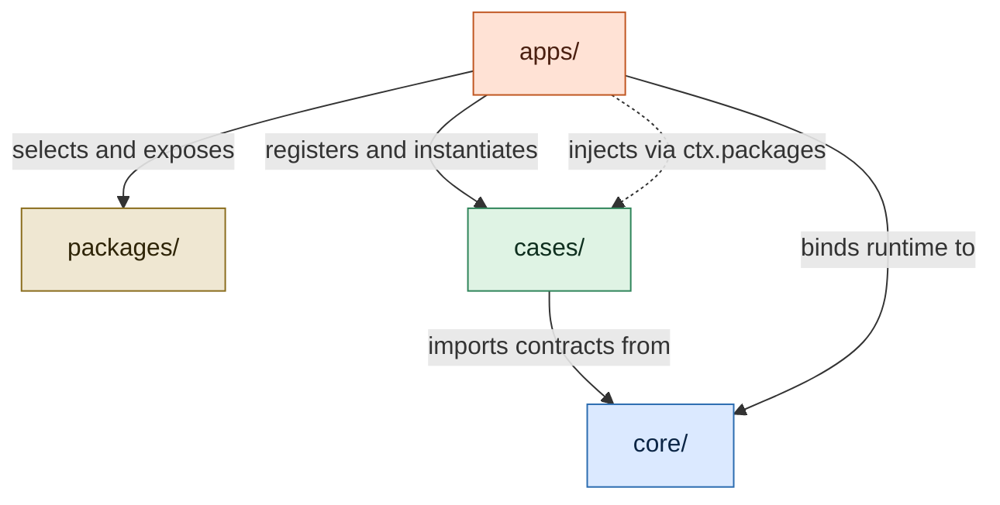
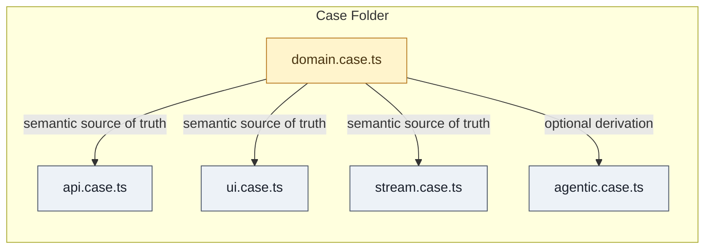
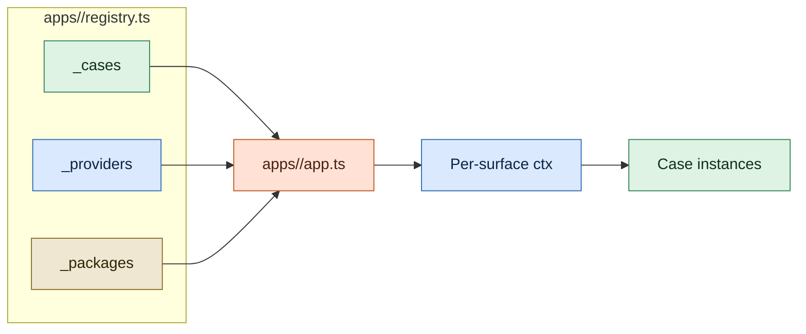
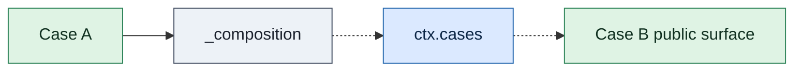
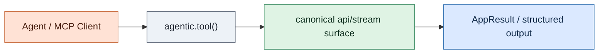
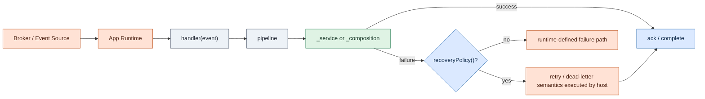

# APP Architecture

This document presents the canonical architectural diagrams of APP in explanatory form.

The normative source remains [`spec.md`](../spec.md). The Mermaid diagrams here are aligned with the spec and are meant to make the protocol easier to learn, teach, and review.

## Visual Grammar

APP diagrams use the same semantic palette throughout:

- `packages/` — shared project code
- `core/` — protocol contracts
- `cases/` — capability ownership
- `apps/` — runtime composition and execution

Arrow semantics:

- solid arrow = direct import, registration, or execution flow
- dashed arrow = contextual exposure or indirect runtime access

## 1. Four Canonical Layers

This is the core architectural picture of APP:

- `cases/` own capabilities
- `core/` owns contracts
- `apps/` own runtime assembly
- `packages/` provide shared project code selected by each app

## 2. A Case as a Capability Unit

Not every Case implements every surface. What matters is that all implemented surfaces belong to the same capability.

## 3. App Registry and Context Materialization

This is how APP resolves abstraction into runtime:

- `_cases` supplies constructors
- `_providers` binds infrastructure
- `_packages` exposes shared project libraries
- the host creates per-surface contexts and instantiates the Cases

## 4. Cross-Case Composition

APP allows composition, but only through explicit runtime boundaries. A Case does not reach into another Case's internals by import path.

## 5. Agentic Execution

The agentic surface is not a shadow implementation. It delegates to canonical execution surfaces.

## 6. Stream Recovery

The Case declares semantics. The app validates and binds them. The runtime executes them.

## 7. Why This Is APP and Not a Layer-First Diagram

The diagrams above describe a capability-first system:

- capability ownership lives in `cases/`
- protocol grammar lives in `core/`
- shared project code lives in `packages/`
- runtime assembly lives in `apps/`

That is the architectural center of gravity of APP. It is not controller-service-repository rearranged with new names.
