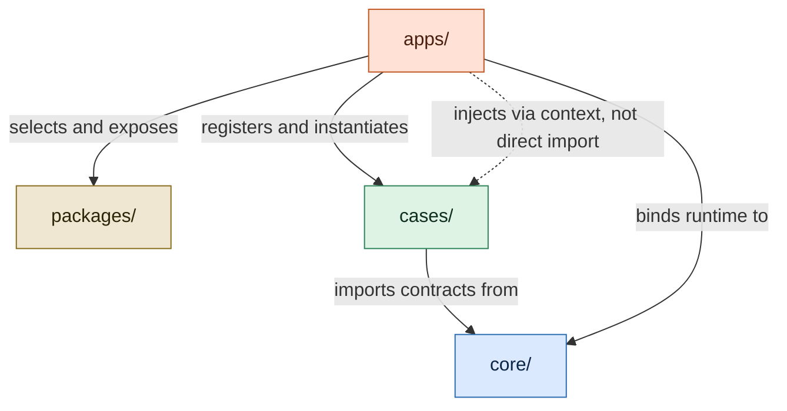
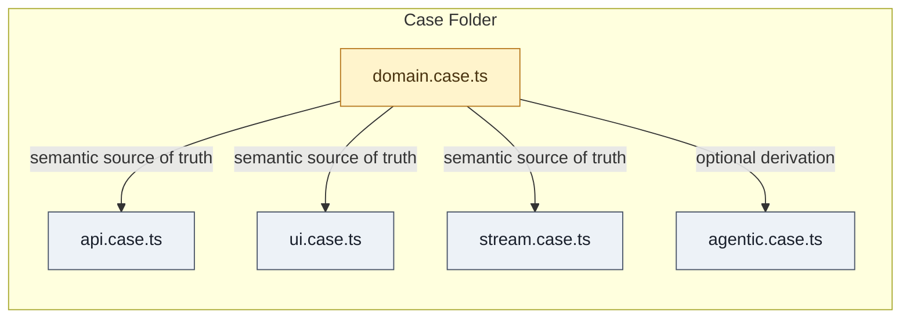
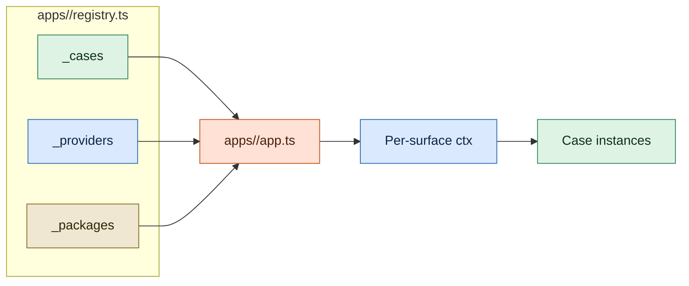
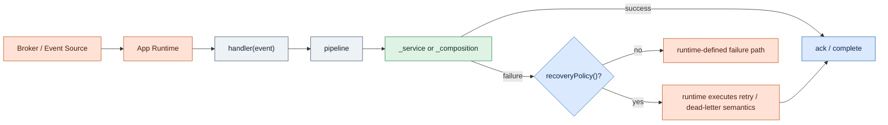

# APP Specification

Status: Working draft

Current snapshot alignment:

- latest released version: [`v0.0.4`](./versions/v0.0.4.md)
- earlier released snapshots: [`v0.0.2`](./versions/v0.0.2.md), [`v0.0.1`](./versions/v0.0.1.md)

This document is the living draft of the AI-First Programming Protocol. Released versions are copied into [`versions/`](./versions).

Language policy:

- this working draft is canonical in English
- early released snapshots in `versions/` are legacy Portuguese documents
- Portuguese backups are preserved in [`i18n/pt-br/`](./i18n/pt-br/)

## 1. Purpose

APP defines a protocol for organizing software in a way that is predictable for humans and legible to AI agents.

The protocol optimizes for:

- low context cost
- explicit semantic ownership
- predictable file and folder structure
- minimal hidden coupling
- agent-ready execution contracts

### 1.1 Architectural Properties Induced by APP

APP defines its own architectural properties. It does not normatively adopt SOLID, DDD, Clean Architecture, or any other prior doctrine as its source of authority.

External comparisons may be useful for explanation, but the normative source of truth remains this protocol.

The protocol induces the following architectural properties:

- **Capability Cohesion** — a `Case` MUST represent a single capability and MUST NOT mix unrelated capabilities in the same semantic unit.
- **Semantic Ownership** — each `Case` MUST own the semantics, contracts, and surfaces of its capability inside its own folder.
- **Explicit Surface Contracts** — every execution or interaction boundary MUST be expressed through canonical surfaces (`domain`, `api`, `ui`, `stream`, `agentic`) instead of ad hoc file conventions.
- **Pure Domain Core** — `domain.case.ts` MUST remain free of I/O, persistence, transport concerns, and arbitrary side effects.
- **Protocol Dependency Inversion** — Cases depend on `core/` contracts; runtime implementations are selected by host apps.
- **Host-Owned Composition Root** — `apps/` own registry assembly, provider binding, package exposure, runtime configuration, and deployment concerns.
- **Explicit Orchestration Boundary** — cross-case composition MUST happen through explicit capability boundaries resolved by the app runtime (`ctx.cases`), never through direct imports between Case folders.
- **Declarative Operational Contracts** — operational behavior that must be legible to tooling or hosts SHOULD be declared as metadata contracts when the protocol provides such a slot (`router()`, `subscribe()`, `recoveryPolicy()`, `tool()`, `mcp()`).
- **Structural Toolability** — shared shapes used by hosts, tooling, and agents (`AppSchema`, `AppResult`, `AppError`, `StreamFailureEnvelope`, registry contracts) MUST remain structurally explicit and stable.
- **Low-Context Navigability** — a capability SHOULD be understandable with minimal navigation; the protocol favors local reasoning over layer scattering.

### 1.2 Conformance Interpretation

APP architectural conformance operates at three levels:

- **Static conformance** — rules that can be checked from filesystem structure, imports, and declarations
- **Review-level conformance** — rules that require architectural judgment, such as capability cohesion
- **Runtime conformance** — rules that must be validated by the host app at bootstrap or execution time

Supporting guidance may expand these levels in project documentation and tooling, but no supporting document overrides the normative statements in this spec.

## 2. Canonical Unit: Case

A `Case` is the canonical unit of organization in APP.

A Case:

- represents a single capability
- owns its local semantics and execution surfaces
- lives in a dedicated folder
- should be understandable with minimal navigation

Examples:

- `user_validate`
- `user_register`
- `theme_toggle`
- `ticket_assign`

## 3. Canonical Structure

An APP project has four canonical layers:

- `packages/` — shared project code resolved by hosts and exposed to contextual Cases through `ctx.packages`
- `core/` — protocol contracts (base classes, shared types, infrastructure interfaces, host contracts)
- `cases/` — capabilities (the shared source of truth for all business logic)
- `apps/` — hosts (each app consumes only the Cases and surfaces it needs and acts as the composition root)

### 3.1 Layer responsibilities

`packages/` is the shared project code layer. It contains project-specific libraries, utilities, design systems, wrappers, and reusable implementation modules. In APP v1, Cases do not import `packages/` directly. Contextual surfaces consume app-selected packages through `ctx.packages`, and the host app decides what is exposed there.

`core/` is the protocol layer. It contains base classes for all surfaces (`domain.case.ts`, `api.case.ts`, `ui.case.ts`, `stream.case.ts`, `agentic.case.ts`) and shared contracts in `core/shared/` (contexts, infrastructure interfaces, structural types, host contracts). No business logic lives here. Every project uses the same contracts; implementations live in `cases/`.

`cases/` is the capability layer. It is shared across all apps. Cases are organized by domain folder (`users/`) and each Case has its own folder (`user_validate/`, `user_register/`). No app owns Cases — apps consume them.

`apps/` is the host layer. Each app is a separate runtime — a backend server, a frontend portal, a set of lambda functions. Each app has its own `app.ts` (bootstrap) and `registry.ts` (which Cases, providers, and packages to load). The protocol defines that `apps/` exists but does not dictate the internal structure of each app.

### 3.2 Directory layout

```text
project/
├── packages/
│   ├── design-system/
│   ├── date-utils/
│   └── http-fetch/
│
├── core/
│   ├── domain.case.ts
│   ├── api.case.ts
│   ├── ui.case.ts
│   ├── stream.case.ts
│   ├── agentic.case.ts
│   └── shared/
│       ├── app_base_context.ts
│       ├── app_infra_contracts.ts
│       ├── app_structural_contracts.ts
│       └── app_host_contracts.ts
│
├── cases/
│   ├── users/
│   │   ├── user_validate/
│   │   │   ├── user_validate.domain.case.ts
│   │   │   ├── user_validate.api.case.ts
│   │   │   ├── user_validate.ui.case.ts
│   │   │   └── user_validate.agentic.case.ts
│   │   └── user_register/
│   │       ├── user_register.domain.case.ts
│   │       ├── user_register.api.case.ts
│   │       ├── user_register.ui.case.ts
│   │       ├── user_register.stream.case.ts
│   │       └── user_register.agentic.case.ts
│
└── apps/
    ├── backend/
    │   ├── app.ts
    │   └── registry.ts
    ├── portal/
    │   ├── app.ts
    │   └── registry.ts
    ├── lambdas/
    │   ├── app.ts
    │   └── registry.ts
    └── chatbot/
        ├── app.ts
        └── registry.ts
```

Not every Case needs every surface. A Case implements only the surfaces relevant to its capability.

Each app in `apps/` is a host — it has its own `registry.ts` that imports only the specific resources it needs. `_cases` imports Case surfaces, `_providers` binds runtime implementations, and `_packages` exposes shared libraries through context. No app is forced to load surfaces or packages it does not use.

> A centralized `cases/cases.ts` is not required at runtime. A project may optionally maintain one for tooling, documentation, or agent discovery, but no app imports it. Similarly, Case manifest files (`<case>.ts`) and domain aggregators (`<domain>.ts`) are optional convenience — the protocol does not require them.

### 3.3 Canonical Architectural Diagrams

The following diagrams are canonical visual summaries of APP. They illustrate the protocol's own architectural grammar and are normative at the semantic level.

Mermaid source is the canonical textual representation. Any stylized renderings in `docs/` are editorial presentations of the same semantics and do not override the protocol.

#### Four Canonical Layers



#### A Case as a Capability Unit



#### App Registry and Context Materialization



## 4. Core Types

APP defines the following shared types in `core/`:

- `Dict<T>` — generic key/value map (`Record<string, T>`)
- `AppSchema` — structural schema type. `AppSchema` is a **compatible subset of JSON Schema (Draft 2020-12)**. Every `AppSchema` value is a valid JSON Schema document — the keywords `type`, `description`, `properties`, `items`, `required`, `enum`, and `additionalProperties` are all standard JSON Schema keywords used with their standard semantics. However, not every JSON Schema is a valid `AppSchema`: the protocol recognizes only the keywords listed above. Additional JSON Schema keywords (e.g., `format`, `minimum`, `pattern`, `oneOf`, `$ref`) are permitted in host extensions but are not guaranteed to be understood by canonical APP tooling. This controlled subset keeps the protocol simple, avoids coupling to a JSON Schema runtime, and ensures that MCP tool schemas can be derived from `AppSchema` without transformation.
- `AppBaseContext` — shared base context for all surfaces. Contains only genuinely cross-cutting concerns: `correlationId` (required — the identity of the context, analogous to OpenTelemetry's traceId), `executionId?` (step-level identity within an operation), `tenantId?`, `userId?`, `logger` (required), `config?`. Defined in `core/shared/app_base_context.ts`.
- Per-surface contexts extend `AppBaseContext` with surface-specific infrastructure: `ApiContext` (httpClient, db, auth, storage, cache, cases, packages), `UiContext` (renderer, router, store, api, packages), `StreamContext` (eventBus, queue, db, cache, cases, packages), `AgenticContext` (cases, packages, mcp). `BaseDomainCase` receives no context (pure by definition). Each surface defines its own canonical grammar — see Section 5.
- `ValueObject<TProps>` — base class for immutable, value-comparable, serializable domain objects. Uses `Object.freeze` internally.
- `DomainExample<TInput, TOutput>` — typed semantic example for domain surfaces.

`Dict` and `AppSchema` are defined in `domain.case.ts` (canonical source). `AppBaseContext` is defined in `core/shared/app_base_context.ts`. Per-surface contexts are defined alongside their respective base classes. Host contracts are defined in `core/shared/app_host_contracts.ts`.

### 4.1 Shared Infrastructure Contracts

APP defines minimal infrastructure contracts in `core/shared/app_infra_contracts.ts`. These are protocol-level interfaces with semantically explicit names. Host projects may extend them.

- `AppHttpClient` — `request(config): Promise<unknown>` (outbound HTTP transport)
- `AppStorageClient` — `get(key): Promise<unknown>`, `set(key, value): Promise<void>` (persistent storage)
- `AppCache` — `get(key): Promise<unknown>`, `set(key, value, ttl?): Promise<void>` (cache with optional TTL)
- `AppEventPublisher` — `publish(event, payload): Promise<void>` (event publication; consume side lives in stream surface)

`AppLogger` is defined in `core/shared/app_base_context.ts` alongside `AppBaseContext`.

Capabilities kept as `unknown` pending semantic stabilization: `auth`, `db`, `queue`.

> Eligibility criteria for future contracts: (1) primary operation is convergent across implementations, (2) interface describes generic infrastructure not domain logic, (3) capability name has stable non-ambiguous meaning within APP.

### 4.2 Shared Structural Contracts

APP defines canonical data shapes in `core/shared/app_structural_contracts.ts` that cross all surfaces:

- `AppError` — `code: string`, `message: string`, `details?: unknown` (structured error interface)
- `AppCaseError` — throwable error class that extends `Error` and implements `AppError`. Surfaces should throw `AppCaseError` for business errors (validation, authorization, composition failures). Common codes: `VALIDATION_FAILED`, `UNAUTHORIZED`, `NOT_FOUND`, `CONFLICT`, `COMPOSITION_FAILED`, `INTERNAL`
- `AppResult<T>` — `success: boolean`, `data?: T`, `error?: AppError` (canonical result wrapper)
- `StreamFailureEnvelope<T>` — canonical dead-letter failure shape for stream runtimes (`caseName`, `surface`, `originalEvent`, `lastError`, `attempts`, timestamps, `correlationId`)
- `AppPaginationParams` — `page?: number`, `limit?: number`, `cursor?: string` (pagination input; supports both offset and cursor strategies)
- `AppPaginatedResult<T>` — `items: T[]`, `total?`, `page?`, `limit?`, `cursor?`, `hasMore?` (paginated result wrapper)

Error handling pattern: surfaces throw `AppCaseError` for business errors. The `BaseApiCase.execute()` pipeline catches `AppCaseError` and returns `{ success: false, error }` as a structured `ApiResponse`. Unexpected runtime errors (not `AppCaseError`) re-throw — the host/adapter decides how to handle them. This separation allows consumers (hosts, agents, adapters) to distinguish between expected failures and unexpected crashes without parsing error messages.

### 4.3 Host Contracts

APP defines minimal host contracts in `core/shared/app_host_contracts.ts` for registry and typing:

- `AppCaseSurfaces` — describes the surfaces available for a Case within a registry. Each key is a canonical surface name (`domain`, `api`, `ui`, `stream`, `agentic`) and the value is a constructor. Only surfaces the app needs are present.
- `AppRegistry` — the unified per-app registry interface with three canonical slots: `_cases`, `_providers`, `_packages`.
- `InferCasesMap` — utility type that derives an instance map from `registry._cases`. Converts constructors to their instance types, preserving the literal key structure for full autocomplete in `_composition`.

Normative slot semantics:

- `_cases` contains only Case surfaces imported from `cases/`.
- `_providers` contains host-mounted providers or adapters that are injected into direct context properties.
- `_packages` contains app-selected shared libraries from `packages/`, exposed to contextual surfaces via `ctx.packages`.

> Registries export constructors for `_cases`, not instances. The host instantiates on demand, passing the appropriate context. This is compatible with all deployment models.

## 5. Surfaces

APP currently defines five canonical surfaces.

Not every Case needs every surface.

For now, `agentic.case.ts` is optional.
If present, it must follow the APP agentic protocol and map back to canonical execution logic.

Every surface that implements a base contract must provide a `test()` method. Tests are mandatory in APP.

### 5.1 Domain Surface

File:

```text
<case>.domain.case.ts
```

Purpose:

- pure semantics
- invariants
- validation rules
- value objects
- domain structures
- input/output schema (structural contracts)
- semantic examples

The domain surface is the **semantic source of truth** of a Case. Other surfaces — especially `agentic.case.ts` — may derive descriptions, schemas, and examples from it.

Base contract: `BaseDomainCase<TInput, TOutput>`

Required members:

- `caseName()` — canonical Case name
- `description()` — semantic description of the capability
- `inputSchema()` — structural input contract (`AppSchema`)
- `outputSchema()` — structural output contract (`AppSchema`)
- `test()` — validates schemas, invariants, and examples internally

Optional members:

- `validate(input)` — pure input validation (must throw on invalid input)
- `invariants()` — list of domain invariants
- `valueObjects()` — map of exposed value objects
- `enums()` — map of exposed enums
- `examples()` — semantic examples (`DomainExample<TInput, TOutput>`)

Utility:

- `definition()` — returns consolidated domain metadata for tooling and derivation

Integration model:

> The domain surface is consumed **manually** by other surfaces. The protocol does not auto-wire `domain.validate()` into the API pipeline or any other surface pipeline. This is by design: the domain is a semantic source of truth for humans, agents, and tooling — not a runtime middleware. Each surface decides if and how to consume domain artifacts. The `agentic` surface demonstrates derived consumption via `domain()` method.

Forbidden:

- IO
- HTTP
- persistence
- logging
- UI rendering
- arbitrary side effects

### 5.2 API Surface

File:

```text
<case>.api.case.ts
```

Purpose:

- input parsing
- authorization
- orchestration
- backend execution
- response mapping

Base contract: `BaseApiCase<TInput, TOutput>`

Required members:

- `handler(input)` — capability entrypoint, returns `ApiResponse<TOutput>`
- `test()` — internal test of the capability (mandatory)

Optional members:

- `router()` — transport bindings (HTTP routes, gRPC definitions, CLI commands)

Protected hooks (all optional):

- `_validate(input)` — input validation before execution
- `_authorize(input)` — authorization check
- `_repository()` — canonical persistence/integration slot (no cross-case calls)
- `_service(input)` — atomic business logic (Case atômico; optional hook)
- `_composition(input)` — cross-case orchestration via `ctx.cases` (Case composto; optional hook)

> `handler` is the capability entrypoint — it receives business input and returns business result. It is not an HTTP endpoint. Transport bindings (HTTP routes, gRPC, CLI) live in `router()` or in the adapter/host. The `router()` delegates to `handler()` and never contains business logic.
>
> `_service` and `_composition` are mutually exclusive as the primary execution slot. Atomic Cases implement `_service`; composed Cases implement `_composition`. Both hooks are optional individually, but the `execute()` pipeline requires that at least one of them exist. If `_composition` exists, it is used; otherwise `_service`.

### 5.3 UI Surface

File:

```text
<case>.ui.case.ts
```

Purpose:

- present interface to the user
- manage local state via viewmodel
- access data via repository
- execute local business logic via service

Canonical grammar: `view <-> _viewmodel <-> _service <-> _repository`

Base contract: `BaseUiCase<TState>`

Required members:

- `view()` — visual entrypoint, the self-contained visual unit (form, table, sidebar, appbar, widget)
- `test()` — internal test of the capability (mandatory)

Protected hooks:

- `_viewmodel()` — transforms state and data into a presentation model for the view
- `_service()` — local business logic (state behavior, client-side validation, local data transformation)
- `_repository()` — data access (API calls, local storage, cache reads)
- `setState(partial)` — state updater

> The view is a self-contained, live visual unit. Framework lifecycle details (render, mount, dismount) live inside `view()` as implementation concerns — the protocol does not dictate lifecycle hooks.
>
> `ui.case.ts` does not include `_composition`. Direct cross-case orchestration from UI is discouraged.
>
> The pattern of separating a UIPresenter + UICase within the same `ui.case.ts` file is allowed as an optional internal structure. The protocol freezes the semantic slots, not the internal class organization.

### 5.4 Stream Surface

File:

```text
<case>.stream.case.ts
```

Purpose:

- event consumption
- publication
- declarative recovery
- idempotency
- pipelines

Canonical event shape: `StreamEvent<T>` — `type` (required), `payload` (required), `idempotencyKey?` (optional — deduplication key for at-least-once brokers such as SQS, Kafka, EventBridge), `metadata?` (optional).

Base contract: `BaseStreamCase<TInput, TOutput>`

Required members:

- `handler(event)` — capability entrypoint, receives `StreamEvent<TInput>`
- `test()` — internal test of the capability (mandatory)

Optional members:

- `subscribe()` — transport bindings (topic subscriptions, queue listeners)
- `recoveryPolicy()` — declarative recovery metadata (`AppStreamRecoveryPolicy`)

Protected hooks:

- `_consume(event)` — initial event consumption
- `_repository()` — canonical persistence/integration slot (idempotência, checkpoints)
- `_service(input)` — atomic business logic (Case atômico)
- `_composition(event)` — cross-case orchestration via `ctx.cases` (Case composto)
- `_publish(output)` — result publication

> `handler` is the capability entrypoint for stream — it receives business events and processes them. Transport bindings (topic subscriptions, queue listeners) live in `subscribe()` or in the adapter/host.
>
> `_service` and `_composition` are mutually exclusive as the primary execution slot. The atomic pipeline flows: `_consume → _service → _publish`. When `_composition` is defined, the pipeline delegates to it directly.
>
> `recoveryPolicy()` is a contract declaration, not an implementation hook. It expresses the intended recovery semantics of the capability; the host app validates and materializes those semantics in the chosen runtime.
>
> The default pipeline in `BaseStreamCase` must not implement production-grade retry, delay scheduling, or dead-letter delivery. When recovery is declared, failure handling belongs to the host/runtime.

Declarative recovery contract:

```ts
export interface AppStreamRecoveryPolicy {
  retry?: {
    maxAttempts: number;
    backoffMs?: number;
    multiplier?: number;
    maxBackoffMs?: number;
    jitter?: boolean;
    retryableErrors?: string[];
  };

  deadLetter?: {
    destination: string;
    includeFailureMetadata?: boolean;
  };
}
```

Dead-letter structural contract:

```ts
export interface StreamFailureEnvelope<T = unknown> {
  caseName: string;
  surface: "stream";
  originalEvent: StreamEvent<T>;
  lastError: { message: string; code?: string; stack?: string };
  attempts: number;
  firstAttemptAt: string;
  lastAttemptAt: string;
  correlationId: string;
}
```

Normative recovery rules:

- `BaseStreamCase` MAY declare `recoveryPolicy(): AppStreamRecoveryPolicy`.
- `recoveryPolicy()` MUST return deterministic, serializable, side-effect-free data and MUST NOT depend on event payload.
- `recoveryPolicy()` MUST NOT perform I/O and MUST NOT contain callbacks or runtime-bound closures.
- `retry.maxAttempts` MUST mean the total number of execution attempts, including the first one. `maxAttempts: 1` means fail-fast.
- `retryableErrors`, when declared, MUST contain logical, stable error codes. Hosts and apps MUST NOT decide retryability from free-form error messages.
- When `retryableErrors` is declared, only matching extracted error codes MAY be treated as retryable. Errors without a matching code MUST be treated as non-retryable.
- `deadLetter.destination` MUST be a logical identifier, not a vendor-specific infrastructure address.
- Logical dead-letter destinations MUST be bound by the app host, not by the Case and not by `core/`.
- If a Stream Case does not declare `recoveryPolicy()`, the protocol defines no recovery guarantee for that Case. Any retry, redelivery, or dead-letter behavior is implementation-defined unless declared elsewhere by the app/runtime.
- If a Stream Case declares `recoveryPolicy()`, the declared recovery semantics become part of the Case contract.
- The app, as composition root, MUST validate at bootstrap that its chosen runtime can honor the declared recovery semantics before registering the stream surface.
- The runtime MAY translate the declared policy to platform-specific configuration, but it MUST NOT weaken or discard the declared semantics.
- If the runtime cannot satisfy the declared semantics, the app MUST refuse to register that stream surface.
- `StreamFailureEnvelope` is the minimum structural dead-letter shape when failure metadata is emitted.
- Circuit breaker is outside the canonical `BaseStreamCase` contract in v1. Hosts, providers, or adapters may implement it separately.

Recovery flow overview:



### 5.5 Agentic Surface

File:

```text
<case>.agentic.case.ts
```

Purpose:

- semantic discovery
- execution context for agents
- structured prompt metadata
- tool exposure
- policy enforcement
- RAG hints and retrieval scope
- MCP integration

Base contract: `BaseAgenticCase<TInput, TOutput>`

Required members:

- `discovery()` — `AgenticDiscovery` (name, description, category, tags, aliases, capabilities, intents)
- `context()` — `AgenticExecutionContext` (auth, tenant, dependencies, preconditions, constraints)
- `prompt()` — `AgenticPrompt` (purpose, whenToUse, whenNotToUse, constraints, reasoningHints, expectedOutcome)
- `tool()` — `AgenticToolContract` (name, description, inputSchema, outputSchema, isMutating, requiresConfirmation, execute)
- `test()` — validates the agentic surface (definition integrity, tool execution, contract consistency)

Optional members:

- `mcp()` — `AgenticMcpContract` (enabled, name, title, description, metadata) — MCP exposure config with normative fallback to `tool`
- `rag()` — `AgenticRagContract` (topics, resources, hints, scope, mode)
- `policy()` — `AgenticPolicy` (requireConfirmation, requireAuth, requireTenant, riskLevel, executionMode, limits)
- `examples()` — `AgenticExample[]` (name, description, input, output, notes)

Utility:

- `definition()` — returns the consolidated `AgenticDefinition` object
- `execute(input)` — shortcut for `tool().execute(input, ctx)`
- `isMcpEnabled()` — checks MCP readiness
- `requiresConfirmation()` — checks both policy and tool contract
- `caseName()` — resolved from discovery or domain fallback

Domain derivation:

The agentic surface supports an optional connection to `domain.case.ts` via the protected `domain()` method. When provided, the following can be derived from the domain instead of being defined manually:

- `domainDescription()` — description
- `domainCaseName()` — canonical name
- `domainInputSchema()` — input schema
- `domainOutputSchema()` — output schema
- `domainExamples()` — examples (only those with defined output are converted)

This reduces semantic duplication and prevents drift between the domain source of truth and the agentic tool contract.

Invariants:

> The agentic tool contract must execute the canonical Case implementation, not a shadow implementation.
>
> When domain derivation is used, the agentic surface consumes from the domain but never overrides canonical execution paths.
>
> The agentic surface has its own descriptive grammar (`discovery`, `context`, `prompt`, `tool`, `mcp`, `rag`, `policy`, `examples`). It does not carry execution slots (`_repository`, `_service`, `_composition`) — execution is delegated to `tool.execute()`, which points to the canonical surface implementation.

Execution policy:

> `executionMode` is a declarative execution policy defined by the Case. Agents may consume this field for planning, UX, and interaction flow. However, enforcement must not depend solely on agent cooperation. The primary enforcement responsibility belongs to the runtime, adapter, gateway, or other host execution layer that mediates tool execution. APP does not mandate a specific enforcement mechanism, but implementations must ensure that the declared policy is respected before execution proceeds.
>
> Mode semantics:
> - `suggest-only`: the capability may be suggested or prepared, but execution must not proceed automatically
> - `manual-approval`: execution requires explicit approval before proceeding
> - `direct-execution`: execution may proceed without an additional approval step, subject to other policies
>
> Policy precedence: when multiple policy fields apply, the more restrictive interpretation prevails.

MCP exposure:

> `tool` is the canonical contract for agent execution. `mcp` is an optional MCP exposure configuration with normative fallback to `tool`.
>
> When `mcp` is defined, the MCP adapter constructs the exposed contract as follows:
> - `name`: uses `mcp.name` if provided, otherwise falls back to `tool.name`
> - `description`: uses `mcp.description` if provided, otherwise falls back to `tool.description`
> - `title`: uses `mcp.title` if provided; otherwise the adapter may derive a display title from `tool.name`
> - `inputSchema` and `outputSchema`: always derived from `tool`
> - `execute`: always delegates to `tool.execute()`
>
> `mcp` controls presence and presentation. It never redefines schemas or execution paths.

## 6. Dependencies and Composition

A Case may depend on:

- `core`
- `core/shared`
- its own local `domain.case.ts`

Infrastructure concerns such as storage, HTTP, auth, queues, or other runtime services should be accessed through context or abstractions owned by `core`.

A Case must not directly import or depend on the internal files of another Case. This rule prohibits structural coupling between Case folders, not cross-case capability invocation.

If semantics are shared across Cases, they should be promoted to:

- `core/shared`, or
- a clearer local semantic abstraction where ownership remains explicit

Special rule:

- `agentic.case.ts` may reference `api.case.ts` or `stream.case.ts` as the canonical execution entrypoint

### 6.1 Cross-Case Composition

APP allows both atomic and composed Cases. A composed Case orchestrates other Cases through the registry (`ctx.cases`) without direct imports between Case folders.

Canonical internal slots per execution surface:

- `handler` — public entrypoint, delegates to the appropriate execution slot
- `_repository` — persistence and local integrations (no cross-case calls)
- `_service` — atomic business logic (Case atômico)
- `_composition` — cross-case orchestration via registry (Case composto)

`_service` and `_composition` are mutually exclusive as the primary execution path. `handler` and `_repository` must not contain composition logic.

Composition is permitted in execution surfaces: `api.case.ts` and `stream.case.ts`. Direct orchestration from `ui.case.ts` is discouraged. `domain.case.ts` remains isolated from cross-case orchestration. `agentic.case.ts` delegates execution to `tool.execute()` which points to the canonical surface — it does not carry `_service` or `_composition` slots.

Per-surface contexts that support composition (`ApiContext`, `StreamContext`) expose `cases?: Dict` for registry-based capability resolution. `AgenticContext` also exposes `cases?: Dict` for tool resolution, but the agentic surface does not use canonical execution slots. Contextual surfaces (`ApiContext`, `UiContext`, `StreamContext`, `AgenticContext`) may also expose `packages?: Dict`, populated by the host from `registry._packages`.

## 7. Apps and Registry

### 7.1 Apps

Each app in `apps/` is a host that consumes Cases. A host is responsible for:

- bootstrap (server, framework, lambda handler, etc.)
- context factory (creating the appropriate per-surface context)
- registry (declaring which Cases and surfaces are loaded)
- deployment model (monolith, lambda, edge functions, grouped functions)

The protocol defines that `apps/` exists and that each app has an `app.ts` (bootstrap) and a `registry.ts` (Case registration). The protocol does not dictate the internal structure of each app — framework choice, function organization, routing strategy, and deployment model are project decisions.

A project typically has multiple apps. Common examples: `backend` (server or API functions), `portal` (customer-facing frontend), `admin` (internal management frontend), `lambdas` (serverless functions), `worker` (background job processor), `chatbot` (agentic host — AI agent interface exposing tools via MCP or direct invocation).

### 7.2 Registry

Each app has its own `registry.ts` that acts as the runtime composition root declaration. The canonical shape is:

```ts
export function createRegistry(config) {
  return {
    _cases: {
      users: {
        user_validate: { api: UserValidateApi },
        user_register: { api: UserRegisterApi, stream: UserRegisterStream },
      },
    },

    _providers: {
      httpClient: new AxiosHttpAdapter(new AxiosClient(config.http)),
    },

    _packages: {
      dateUtils: DateUtils,
      designSystem: DesignSystem,
    },
  } as const;
}
```

Normative import rules for `registry.ts`:

- `_cases` imports only from `cases/`
- `_providers` is the only slot that binds runtime implementations to context properties
- `_packages` imports only from `packages/`

The `_cases` shape remains `domain → case → surfaces`. This same shape feeds `ctx.cases` for cross-case composition.

> Runtime registration belongs to each host app. No global `cases/cases.ts` is required for runtime. A project may optionally maintain a `cases/cases.ts` for tooling, documentation, or agent discovery, but no app imports it at runtime.
>
> This per-app design ensures zero cross-surface coupling: the backend never loads UI dependencies, the portal never loads API or Stream dependencies. Each app's import graph contains only what it needs.
>
> Runtime bindings for stream recovery also belong here. If a Stream Case declares a logical `deadLetter.destination`, the app host is responsible for mapping that logical identifier to the physical destination supported by its runtime.

### 7.3 Context, `ctx.cases`, and `ctx.packages`

The host is responsible for creating per-surface contexts. When creating contextual surfaces, the host maps the unified registry into the context:

```ts
function createApiContext(): ApiContext {
  return {
    correlationId: generateId(),
    logger,
    cases: buildCasesFromRegistry(registry._cases),
    httpClient: registry._providers.httpClient,
    packages: registry._packages,
  };
}
```

Normative rules:

- `ctx.cases` is derived from `registry._cases`
- direct context properties (`ctx.httpClient`, `ctx.cache`, etc.) are derived from `registry._providers`
- `ctx.packages` is derived from `registry._packages`
- `cases/` MUST NOT import `packages/` directly
- contextual Case surfaces MUST consume shared project libraries through `ctx.packages`

This means `ctx.cases` contains only the Cases and surfaces registered in that specific app, and `ctx.packages` contains only the packages that app chose to expose. A backend can expose API and Stream composition plus selected packages. A portal can expose UI cases plus a design system package. Composition resolves only within the app's boundary.

`domain.case.ts` remains outside this runtime flow because it receives no context. Package consumption via context is a rule for contextual surfaces, not for pure domain code.

### 7.4 Deployment models

The deployment model changes how `app.ts` consumes the registry, not the Cases themselves. APP supports any model — the choice is the project's.

#### Monolith

A single process loads all Cases from the registry, collects transport bindings (`router()`, `subscribe()`), and mounts a unified server.

```ts
// apps/backend/app.ts — monolith
import { registry } from "./registry";

for (const [domain, cases] of Object.entries(registry._cases)) {
  for (const [caseName, surfaces] of Object.entries(cases)) {
    if (surfaces.api) {
      const ctx = createApiContext();
      const instance = new surfaces.api(ctx);
      if (instance.router) instance.router();
    }
  }
}
```

#### Lambda / Edge — one function per feature

Each feature (domain) becomes a single lambda function containing all Cases of that domain. The lambda resolves which Case to execute based on the incoming route or event type.

A feature is a domain group (e.g. `users`). The lambda "users" contains `user_validate` + `user_register`. On cold start, the lambda builds a route table from the `router()` of each Case in that feature. On invocation, it matches the path and delegates to the correct `handler()`.

```ts
// apps/lambdas/app.ts — one lambda per feature
import { registry } from "./registry";

export function createFeatureHttpHandler(featureName: string) {
  const featureCases = registry[featureName];
  const routeTable = buildRouteTable(featureCases);

  return async (event) => {
    const route = routeTable.find(r => matches(r, event));
    const ctx = createApiContext(featureName);
    const instance = new route.CaseClass(ctx);
    return instance.handler(parseInput(event));
  };
}

// Each export becomes a lambda in the deploy config
export const usersHttp = createFeatureHttpHandler("users");
```

For stream events, the same model applies: the lambda builds a subscription map from `subscribe()` of each stream Case, and dispatches by event type.

```ts
export function createFeatureStreamHandler(featureName: string) {
  const featureCases = registry[featureName];
  const subscriptionMap = buildSubscriptionMap(featureCases);

  return async (sqsEvent) => {
    for (const record of sqsEvent.Records) {
      const event = JSON.parse(record.body);
      const entry = subscriptionMap.get(event.type);
      const ctx = createStreamContext(featureName);
      const instance = new entry.CaseClass(ctx);
      await instance.handler(event);
    }
  };
}

export const usersStream = createFeatureStreamHandler("users");
```

#### Lambda — one function per Case

Each Case becomes its own lambda. Simpler routing (one path per function) but more deploy units.

```ts
// Inline function — no feature grouping needed
import { UserRegisterApi } from "../../cases/users/user_register/user_register.api.case";

export const handler = async (event) => {
  const ctx = createApiContext();
  const instance = new UserRegisterApi(ctx);
  return instance.handler(JSON.parse(event.body));
};
```

#### Hybrid / Grouped functions

Any combination is valid. A project might group high-traffic domains into dedicated lambdas and keep low-traffic domains in a single shared lambda. The Cases are unchanged — only the host wiring differs.

### 7.5 Transport bindings

Cases declare transport bindings through optional public methods:

- API surface: `router()` returns framework-specific route definitions (HTTP method, path, handler). The host collects these to mount routes.
- Stream surface: `subscribe()` returns framework-specific subscription definitions (topic, queue, handler). The host collects these to mount event listeners.

These methods are **declarative** — they describe what the Case exposes, not how the framework implements it. The return type is `unknown` because the specific shape depends on the framework (Hono, Express, SQS, Kafka, etc.).

In a monolith, the host iterates all Cases and mounts all bindings at startup. In a lambda-per-feature model, the host uses these bindings to build route tables and subscription maps during cold start. In a lambda-per-Case model, the bindings may be unused since the function URL or event source mapping handles routing externally.

> `handler()` is the capability entrypoint — it receives business input and returns business result. `router()` and `subscribe()` are transport bindings — they bridge the framework to the handler. Transport bindings delegate to `handler()` and never contain business logic.

## 8. Conformance

An implementation is APP-aligned when it preserves these invariants:

1. Case is the primary unit of ownership.
2. Cases are structurally predictable.
3. Domain semantics stay pure.
4. Cross-case coupling remains explicit and minimal.
5. Agentic execution maps back to canonical code paths.
6. Every surface that implements a base contract provides a `test(): Promise<void>` method. The canonical signature takes no arguments and returns `Promise<void>` — tests create their own inputs internally and assert results. See §8.1 for the canonical test model.

Formal conformance tooling is planned, but not yet defined.

### 8.1 Canonical Test Model

The `test()` method is the Case's self-contained proof of correctness. It is not a unit test in the xUnit sense — it is a **conformance test** that validates the surface contract from inside the Case itself.

**Principle:** the test belongs to the Case, not to the test runner. A Case that passes `test()` is asserting that its own contract is internally consistent and that its public capabilities produce expected results for known inputs. The protocol does not mandate a test runner, assertion library, or isolation framework — `test()` throws on failure, returns on success.

**Canonical structure — phased, integrated, single method.**

A `test()` method is organized in sequential phases. Each phase validates a layer of the Case. All phases run inside the same `test()` call. There is no separate test file — the test lives inside the surface class.

The phases follow the surface's own layering: structural integrity first, then individual slot behavior, then integrated execution. The exact phases depend on the surface type, but the pattern is consistent:

**Domain surface phases:**

```
Phase 1 — Definition integrity
  definition() returns valid caseName, description, inputSchema, outputSchema

Phase 2 — Validation behavior
  validate() accepts known-valid input without throwing
  validate() rejects known-invalid input (throws)

Phase 3 — Examples consistency
  examples() entries with valid=true pass validate()
  examples() entries with errors have expected output shape
```

**API surface phases:**

```
Phase 1 — Slot availability
  At least one of _service or _composition is implemented
  _validate and _authorize are callable (if present)

Phase 2 — Validation and authorization
  _validate() accepts valid input without throwing
  _validate() rejects invalid input (throws)
  _authorize() completes without error (if present)

Phase 3 — Integrated execution
  handler() with known-valid input returns { success: true, data }
  data has expected shape
```

**Stream surface phases:**

```
Phase 1 — Subscription shape
  subscribe() returns expected topic/binding

Phase 2 — Pipeline slots
  _consume() extracts payload correctly (if present)
  _service() processes extracted data (if present)

Phase 3 — Integrated execution
  handler() with synthetic event completes without error
```

**UI surface phases:**

```
Phase 1 — View renders
  view() returns a non-null result

Phase 2 — Slot behavior
  _viewmodel() produces a valid presentation model (if present)
  _service() performs expected state transformations (if present)

Phase 3 — Integrated round-trip
  setState() + view() produces updated output
```

**Agentic surface phases:**

```
Phase 1 — Definition integrity
  validateDefinition() passes (discovery, tool, prompt are consistent)

Phase 2 — Contract consistency
  tool.inputSchema matches expected shape
  prompt.purpose is non-empty
  mcp, if enabled, has valid name

Phase 3 — Tool execution
  tool.execute() with known input produces expected output
```

**Key constraints:**

- `test()` creates its own data internally — no external fixtures or dependency injection.
- `test()` uses `throw` for assertion — no dependency on assertion libraries.
- `test()` validates the surface as a whole — phases are conceptual organization, not separate methods.
- `test()` is synchronous in intent: phases run sequentially, each building on the previous.
- A Case with multiple layers (e.g., API with `_validate`, `_authorize`, `_composition`) tests all layers in a single `test()` call. This is the "phased but integrated" model.
- The protocol does not prescribe mocking. If a slot needs infrastructure (e.g., `_repository` needs a DB), the test may skip that slot or use a minimal in-memory substitute. The goal is contract verification, not full integration testing.

## 9. Non-Goals

APP does not currently define:

- a standard runtime
- a framework-specific implementation
- a package manager model
- a production-ready MCP server format
- an importable runtime library — APP is a protocol, not a framework. Base classes in `core/` are illustrative reference implementations, not runtime dependencies. Projects adopt the protocol by following the canonical structure, not by importing a package.
- a CLI or scaffold tool — Case generation is delegated to AI-powered tooling (skill `/app`, planned for v0.0.4+), which adapts to the project's language and context. Static templates cannot match this flexibility.
- lifecycle hooks (`onInit`, `onDestroy`, etc.) — Case lifecycle is managed by the host, not by the protocol. Lambda hosts have no lifecycle; monolith hosts may implement lifecycle management as host-specific infrastructure. The protocol intentionally does not prescribe lifecycle contracts to avoid coupling Cases to a specific hosting model.

## 10. Naming

Recommended terminology:

- `AI-First Programming` refers to the paradigm
- `APP` refers to the protocol

This distinction is useful because the philosophy may grow beyond the current spec, while APP remains the concrete protocol definition.

## 11. Open Work

### Closed in v0.0.4

- ~~Standalone example in `examples/typescript/`~~ — Task Manager project with 4 Cases, 5 surfaces each, 3 app hosts, `run.ts` with 18 passing tests
- ~~Automated test runner for illustrative code~~ — `examples/typescript/run.ts` boots all hosts, runs full scenario, invokes `test()` on all 18 surfaces
- ~~Validate stream recovery conformance~~ — `recoveryPolicy()` declarative contract (Q10), `StreamFailureEnvelope` structural shape, bootstrap compatibility validation, host-level dead-letter binding, rejection, and failure-envelope emission are now illustrated in `src/` and `examples/typescript/`
- ~~Document cross-surface composition~~ — covered by `_composition` (Q6) + `_publish`/`subscribe` (core). Saga/outbox patterns are host-level implementation, not protocol scope
- ~~Define `packages/` layer~~ — four canonical layers `packages/ → core/ → cases/ → apps/` (Q9), `AppRegistry` with `_cases`, `_providers`, `_packages`, `ctx.packages` in all contexts, plus initial static boundary validation via `npm run validate:boundaries`
- ~~Validate `apps/chatbot/` consuming agentic surfaces end-to-end~~ — chatbot hosts now register agentic surfaces and resolve canonical API execution through `ctx.cases` using the same registry contract as other apps
- ~~Document APP-induced architectural properties~~ — canonical architectural properties, diagrams, and conformance levels are now formalized in `spec.md`, `docs/architectural-properties.md`, `docs/architecture.md`, and `docs/conformance.md`

### Open for v0.0.5

- Strengthen static conformance tooling beyond the initial boundary validator (`validate:boundaries`) with deeper registry and import-graph checks
- Add another non-TypeScript reference implementation to validate protocol portability

### v0.0.5+ — Skill `/app`

- AI-powered skill for APP development: conformance validation, Case scaffold, guided development cycle, refactoring — language-agnostic by design
- Replaces traditional linter (infeasible across languages) and CLI scaffold (APP is protocol, not framework)
- Can subsume and extend `packages/` dependency enforcement (import direction, registry slot validation, contextual package exposure)

### v0.0.6+ — Operational Platform

- APP project → MCP server adapter (automatic tool exposure from agentic registry)
- Multi-language reference implementations (Python, Go, .NET) generated and maintained by skill `/app`
- Migration guide for existing projects
- Case-Oriented Software Manifesto: ontology, composition rules, evolution model, developer mental model
