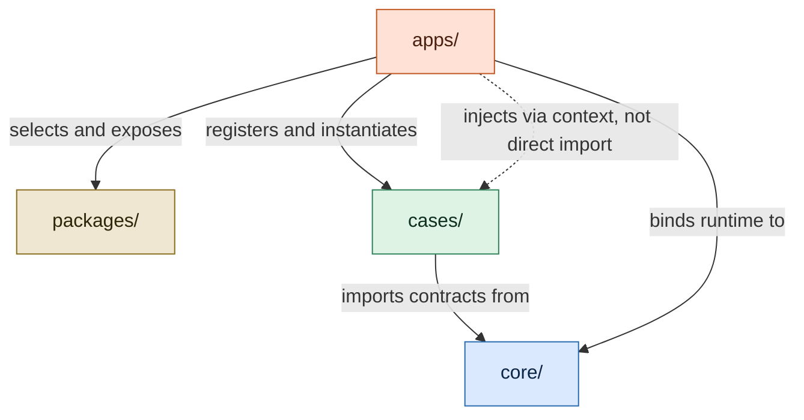
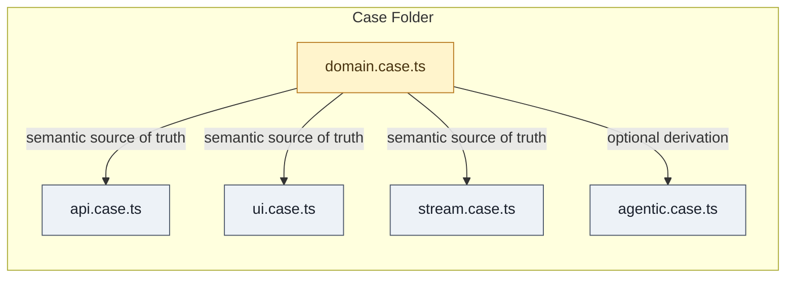
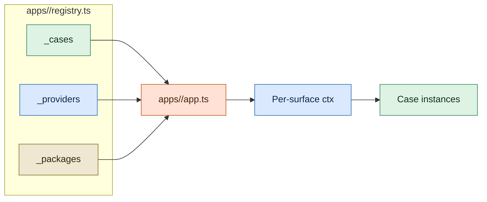
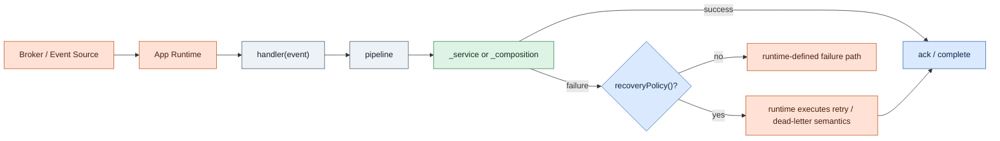

# APP Specification

Status: Released snapshot (`v1.0.0`)

Release alignment:

- snapshot version: [`v1.0.0`](./v1.0.0.md)
- earlier released snapshots: [`v0.0.12`](./v0.0.12.md), [`v0.0.11`](./v0.0.11.md), [`v0.0.10`](./v0.0.10.md), [`v0.0.9`](./v0.0.9.md), [`v0.0.8`](./v0.0.8.md), [`v0.0.7`](./v0.0.7.md), [`v0.0.6`](./v0.0.6.md), [`v0.0.5`](./v0.0.5.md), [`v0.0.4`](./v0.0.4.md), [`v0.0.2`](./v0.0.2.md), [`v0.0.1`](./v0.0.1.md)

This document is the released `v1.0.0` snapshot of the AI-First Programming Protocol.
The living draft continues in [`../spec.md`](../spec.md).

Language policy:

- this working draft is canonical in English
- early released snapshots in `versions/` are legacy Portuguese documents
- Portuguese backups are preserved in [`../i18n/pt-br/`](../i18n/pt-br/)

## 1. Purpose

APP defines a protocol for organizing software in a way that is predictable for humans and legible to AI agents.

The protocol optimizes for:

- low context cost
- explicit semantic ownership
- predictable file and folder structure
- minimal hidden coupling
- agent-ready execution contracts

### 1.1 Architectural Properties Induced by APP

APP defines its own architectural properties. It does not normatively adopt SOLID, DDD, Clean Architecture, or any other prior doctrine as its source of authority.

External comparisons may be useful for explanation, but the normative source of truth remains this protocol.

The protocol induces the following architectural properties:

- **Capability Cohesion** — a `Case` MUST represent a single capability and MUST NOT mix unrelated capabilities in the same semantic unit.
- **Semantic Ownership** — each `Case` MUST own the semantics, contracts, and surfaces of its capability inside its own folder.
- **Explicit Surface Contracts** — every execution or interaction boundary MUST be expressed through canonical surfaces (`domain`, `api`, `ui`, `stream`, `agentic`) instead of ad hoc file conventions.
- **Pure Domain Core** — `domain.case.ts` MUST remain free of I/O, persistence, transport concerns, and arbitrary side effects.
- **Protocol Dependency Inversion** — Cases depend on `core/` contracts; runtime implementations are selected by host apps.
- **Host-Owned Composition Root** — `apps/` own registry assembly, provider binding, package exposure, runtime configuration, and deployment concerns.
- **Explicit Orchestration Boundary** — cross-case composition MUST happen through explicit capability boundaries resolved by the app runtime (`ctx.cases`), never through direct imports between Case folders.
- **Declarative Operational Contracts** — operational behavior that must be legible to tooling or hosts SHOULD be declared as metadata contracts when the protocol provides such a slot (`router()`, `subscribe()`, `recoveryPolicy()`, `tool()`, `mcp()`).
- **Structural Toolability** — shared shapes used by hosts, tooling, and agents (`AppSchema`, `AppResult`, `AppError`, `StreamFailureEnvelope`, registry contracts) MUST remain structurally explicit and stable.
- **Low-Context Navigability** — a capability SHOULD be understandable with minimal navigation; the protocol favors local reasoning over layer scattering.

### 1.2 Conformance Interpretation

APP architectural conformance operates at three levels:

- **Static conformance** — rules that can be checked from filesystem structure, imports, and declarations
- **Review-level conformance** — rules that require architectural judgment, such as capability cohesion
- **Runtime conformance** — rules that must be validated by the host app at bootstrap or execution time

Supporting guidance may expand these levels in project documentation and tooling, but no supporting document overrides the normative statements in this spec.

## 2. Paradigm

APP is the protocol for the **AI-First Programming** paradigm.

The relationship between these layers is:

```text
AI-First Programming          ← paradigm (conceptual layer)
  └─ APP                      ← protocol (normative layer)
       └─ Implementations     ← concrete projects (execution layer)
```

APP is the first normative expression of the AI-First Programming paradigm, not the only one possible. Other protocols may emerge within the same paradigm.

### 2.1 Paradigm Declarations

The AI-First Programming paradigm is defined by five declarations:

**Ontology** — A system is made of capabilities, each organized as a Case with predictable surfaces (`domain`, `api`, `ui`, `stream`, `agentic`).

**Composition** — Cases compose through explicit boundaries, never through implicit coupling. Four canonical forms exist: intra-Case collaboration, cross-Case synchronous (`ctx.cases`), cross-Case event-driven (`_publish`/`subscribe`), and host-mediated orchestration.

**Evolution** — A system grows by adding and separating Cases, not by scattering logic across generic layers. Each new capability is a new Case, not a new layer.

**Cognition** — The developer's primary question is "what capability am I creating?", not "what layer am I in?" or "what service do I expose?". The Case is the unit of thought.

**Operability** — Humans and agents are peers in understanding and operating the system. AI is a design priority, not a substitute for judgment. Software is structured to be legible, generable, and operable by both.

### 2.2 Operational Resolutions

The following operational resolutions are conceptually closed and define APP's current public direction:

- **Canonical Capability Adapter** — an APP project may be projected into an external tool runtime through a Canonical Capability Adapter. The adapter exposes canonical capabilities as tools while preserving tool identity, input/output schemas, execution path, and declared policy. It projects capability execution; it does not reimplement capability logic.
- **Adapter Ownership** — the protocol may define projection constraints, but concrete adapters belong to ecosystem tooling, skill `/app`, or project hosts. APP itself does not ship the operational adapter as part of the protocol.
- **Composition Sufficiency** — the four canonical composition forms defined above are sufficient for APP v1. Multi-step agent planning, tool-call chaining, and agent runtime orchestration are operational concerns outside protocol semantics.
- **Manifesto Materialization** — the five paradigm declarations above are already the canonical manifesto base for AI-First Programming. Supporting documents may expand them, but they do not override or replace them.
- **Standalone Example Closure** — `examples/typescript/` is the closed executable reference baseline for the current protocol generation.

## 3. Canonical Unit: Case

A `Case` is the canonical unit of organization in APP.

A Case:

- represents a single capability
- owns its local semantics and execution surfaces
- lives in a dedicated folder
- should be understandable with minimal navigation

Examples:

- `user_validate`
- `user_register`
- `theme_toggle`
- `ticket_assign`

## 4. Canonical Structure

An APP project has four canonical layers:

- `packages/` — shared project code resolved by hosts and exposed to contextual Cases through `ctx.packages`
- `core/` — protocol contracts (base classes, shared types, infrastructure interfaces, host contracts)
- `cases/` — capabilities (the shared source of truth for all business logic)
- `apps/` — hosts (each app consumes only the Cases and surfaces it needs and acts as the composition root)

### 4.1 Layer responsibilities

`packages/` is the shared project code layer. It contains project-specific libraries, utilities, design systems, wrappers, and reusable implementation modules. In APP v1, Cases do not import `packages/` directly. Contextual surfaces consume app-selected packages through `ctx.packages`, and the host app decides what is exposed there. A new APP project may begin with an empty `packages/` layer when no host-selected shared code is needed yet.

`core/` is the protocol layer. It contains base classes for all surfaces (`domain.case.ts`, `api.case.ts`, `ui.case.ts`, `stream.case.ts`, `agentic.case.ts`) and shared contracts in `core/shared/` (contexts, infrastructure interfaces, structural types, host contracts). No business logic lives here. Every project uses the same contracts; implementations live in `cases/`.

`cases/` is the capability layer. It is shared across all apps. Cases are organized by domain folder (`users/`) and each Case has its own folder (`user_validate/`, `user_register/`). No app owns Cases — apps consume them.

`apps/` is the host layer. Each app is a separate runtime — a backend server, a frontend portal, a set of lambda functions. Each app has its own `app.ts` (bootstrap) and `registry.ts` (which Cases, providers, and packages to load). The protocol defines that `apps/` exists but does not dictate the internal structure of each app.

### 4.2 Directory layout

```text
project/
├── packages/
│   ├── design-system/
│   ├── date-utils/
│   └── http-fetch/
│
├── core/
│   ├── domain.case.ts
│   ├── api.case.ts
│   ├── ui.case.ts
│   ├── stream.case.ts
│   ├── agentic.case.ts
│   └── shared/
│       ├── app_base_context.ts
│       ├── app_infra_contracts.ts
│       ├── app_structural_contracts.ts
│       └── app_host_contracts.ts
│
├── cases/
│   ├── users/
│   │   ├── user_validate/
│   │   │   ├── user_validate.domain.case.ts
│   │   │   ├── user_validate.api.case.ts
│   │   │   ├── user_validate.ui.case.ts
│   │   │   └── user_validate.agentic.case.ts
│   │   └── user_register/
│   │       ├── user_register.domain.case.ts
│   │       ├── user_register.api.case.ts
│   │       ├── user_register.ui.case.ts
│   │       ├── user_register.stream.case.ts
│   │       └── user_register.agentic.case.ts
│
└── apps/
    ├── backend/
    │   ├── app.ts
    │   └── registry.ts
    ├── portal/
    │   ├── app.ts
    │   └── registry.ts
    ├── lambdas/
    │   ├── app.ts
    │   └── registry.ts
    └── agent/
        ├── app.ts
        └── registry.ts
```

Not every Case needs every surface. A Case implements only the surfaces relevant to its capability.

Optional supporting artifacts may live inside a Case folder when they do not
redefine the canonical surface grammar. The canonical support artifact is
`<case>.us.md`, a human/agent-facing specification aid used to capture intent,
business rules, planned surfaces, validation scenarios, and open questions for a
Case. `<case>.us.md` is not required for baseline APP filesystem conformance,
but stricter operational profiles such as skill `/app` may require it for new
Cases or significant semantic changes.

Each app in `apps/` is a host — it has its own `registry.ts` that imports only the specific resources it needs. `_cases` imports Case surfaces, `_providers` binds runtime implementations, and `_packages` exposes shared libraries through context. No app is forced to load surfaces or packages it does not use.

> A centralized `cases/cases.ts` is not required at runtime. A project may optionally maintain one for tooling, documentation, or agent discovery, but no app imports it. Similarly, Case manifest files (`<case>.ts`) and domain aggregators (`<domain>.ts`) are optional convenience — the protocol does not require them.

### 4.3 Canonical Architectural Diagrams

The following diagrams are canonical visual summaries of APP. They illustrate the protocol's own architectural grammar and are normative at the semantic level.

Mermaid source is the canonical textual representation. Any stylized renderings in `docs/` are editorial presentations of the same semantics and do not override the protocol.

#### Four Canonical Layers



#### A Case as a Capability Unit



#### App Registry and Context Materialization



### 4.4 Project Bootstrap and Incremental Adoption

APP supports both greenfield projects and incremental adoption inside existing codebases.

For a new APP project:

- the minimum practical structure is `core/`, `cases/`, and at least one host in `apps/`
- `packages/` remains part of the canonical layer model, but it may start empty until shared project code is actually needed
- a host app may start with a single `registry.ts`, a single `app.ts`, and one or more Cases

For an existing project:

- adoption may be incremental and bounded to a subset of the repository
- a project may introduce APP Cases and host registries without migrating all legacy code at once
- legacy code may remain outside APP grammar while new or refactored capability slices adopt APP
- conformance should be evaluated on the APP-managed area, not on unrelated legacy areas

APP does not require a big-bang migration. New capability work may begin in APP while older structures coexist during transition.

## 5. Core Types

APP defines the following shared types in `core/`:

- `Dict<T>` — generic key/value map (`Record<string, T>`)
- `AppSchema` — structural schema type. `AppSchema` is a **compatible subset of JSON Schema (Draft 2020-12)**. Every `AppSchema` value is a valid JSON Schema document — the keywords `type`, `description`, `properties`, `items`, `required`, `enum`, and `additionalProperties` are all standard JSON Schema keywords used with their standard semantics. However, not every JSON Schema is a valid `AppSchema`: the protocol recognizes only the keywords listed above. Additional JSON Schema keywords (e.g., `format`, `minimum`, `pattern`, `oneOf`, `$ref`) are permitted in host extensions but are not guaranteed to be understood by canonical APP tooling. This controlled subset keeps the protocol simple, avoids coupling to a JSON Schema runtime, and ensures that MCP tool schemas can be derived from `AppSchema` without transformation.
- `AppBaseContext` — shared base context for all surfaces. Contains only genuinely cross-cutting concerns: `correlationId` (required — the identity of the context, analogous to OpenTelemetry's traceId), `executionId?` (step-level identity within an operation), `tenantId?`, `userId?`, `logger` (required), `config?`. Defined in `core/shared/app_base_context.ts`.
- Per-surface contexts extend `AppBaseContext` with surface-specific infrastructure: `ApiContext` (httpClient, db, auth, storage, cache, cases, packages), `UiContext` (renderer, router, store, api, packages), `StreamContext` (eventBus, queue, db, cache, cases, packages), `AgenticContext` (cases, packages, mcp). `BaseDomainCase` receives no context (pure by definition). Each surface defines its own canonical grammar — see Section 5.
- `ValueObject<TProps>` — base class for immutable, value-comparable, serializable domain objects. Uses `Object.freeze` internally.
- `DomainExample<TInput, TOutput>` — typed semantic example for domain surfaces.

`Dict` and `AppSchema` are defined in `domain.case.ts` (canonical source). `AppBaseContext` is defined in `core/shared/app_base_context.ts`. Per-surface contexts are defined alongside their respective base classes. Host contracts are defined in `core/shared/app_host_contracts.ts`.

### 5.1 Shared Infrastructure Contracts

APP defines minimal infrastructure contracts in `core/shared/app_infra_contracts.ts`. These are protocol-level interfaces with semantically explicit names that illustrate good integration boundaries when a capability has sufficiently convergent meaning across stacks.

These contracts are intentionally partial. APP does not aim to define a complete or final model of application infrastructure. Their purpose is to provide a small set of stable examples for host-to-Case integration, not to freeze how every project must model infrastructure.

Host projects may extend these contracts, wrap them differently, or keep adjacent capabilities host-defined as long as the canonical APP surface semantics are preserved.

- `AppHttpClient` — `request(config): Promise<unknown>` (outbound HTTP transport)
- `AppStorageClient` — `get(key): Promise<unknown>`, `set(key, value): Promise<void>` (persistent storage)
- `AppCache` — `get(key): Promise<unknown>`, `set(key, value, ttl?): Promise<void>` (cache with optional TTL)
- `AppEventPublisher` — `publish(event, payload): Promise<void>` (event publication; consume side lives in stream surface)

`AppLogger` is defined in `core/shared/app_base_context.ts` alongside `AppBaseContext`.

Capabilities such as `auth`, `db`, and `queue` remain deliberately host-defined. APP does not require canonical minimal interfaces for them, and projects may model them freely according to language, framework, runtime, and domain needs.

> Eligibility criteria for any additional shared infrastructure contract: (1) primary operation is convergent across implementations, (2) interface describes generic infrastructure not domain logic, (3) capability name has stable non-ambiguous meaning within APP. APP is not obligated to standardize a capability merely because it is common.

### 5.2 Shared Structural Contracts

APP defines canonical data shapes in `core/shared/app_structural_contracts.ts` that cross all surfaces:

- `AppError` — `code: string`, `message: string`, `details?: unknown` (structured error interface)
- `AppCaseError` — throwable error class that extends `Error` and implements `AppError`. Surfaces should throw `AppCaseError` for business errors (validation, authorization, composition failures). Common codes: `VALIDATION_FAILED`, `UNAUTHORIZED`, `NOT_FOUND`, `CONFLICT`, `COMPOSITION_FAILED`, `INTERNAL`
- `AppResult<T>` — `success: boolean`, `data?: T`, `error?: AppError` (canonical result wrapper)
- `StreamFailureEnvelope<T>` — canonical dead-letter failure shape for stream runtimes (`caseName`, `surface`, `originalEvent`, `lastError`, `attempts`, timestamps, `correlationId`)
- `AppPaginationParams` — `page?: number`, `limit?: number`, `cursor?: string` (pagination input; supports both offset and cursor strategies)
- `AppPaginatedResult<T>` — `items: T[]`, `total?`, `page?`, `limit?`, `cursor?`, `hasMore?` (paginated result wrapper)

Error handling pattern: surfaces throw `AppCaseError` for business errors. The `BaseApiCase.execute()` pipeline catches `AppCaseError` and returns `{ success: false, error }` as a structured `ApiResponse`. Unexpected runtime errors (not `AppCaseError`) re-throw — the host/adapter decides how to handle them. This separation allows consumers (hosts, agents, adapters) to distinguish between expected failures and unexpected crashes without parsing error messages.

### 5.3 Host Contracts

APP defines minimal host contracts in `core/shared/app_host_contracts.ts` for registry and typing. This working draft extends that host-contract model for agentic apps:

- `AppCaseSurfaces` — describes the surfaces available for a Case within a registry. Each key is a canonical surface name (`domain`, `api`, `ui`, `stream`, `agentic`) and the value is a constructor. Only surfaces the app needs are present.
- `AppRegistry` — the unified per-app registry interface with three canonical slots: `_cases`, `_providers`, `_packages`.
- `AgenticRegistry` — the normative extension of `AppRegistry` for hosts that publish agentic capabilities. It derives catalogs and tool resolution from registered `agentic` surfaces rather than from parallel metadata stores.
- `InferCasesMap` — utility type that derives an instance map from `registry._cases`. Converts constructors to their instance types, preserving the literal key structure for full autocomplete in `_composition`.

Normative slot semantics:

- `_cases` contains only Case surfaces imported from `cases/`.
- `_providers` contains host-mounted providers or adapters that are injected into direct context properties.
- `_packages` contains app-selected shared libraries from `packages/`, exposed to contextual surfaces via `ctx.packages`.

> Registries export constructors for `_cases`, not instances. The host instantiates on demand, passing the appropriate context. This is compatible with all deployment models.

When a host claims app-level agentic conformance, `AgenticRegistry` adds the
following required behaviors on top of `AppRegistry`:

- `listAgenticCases()` — enumerate the registered Cases that actually expose an `agentic` surface in that host
- `getAgenticSurface(ref)` — resolve the registered `agentic` surface constructor for a Case reference
- `instantiateAgentic(ref, ctx)` — instantiate the `agentic` surface with the current `AgenticContext`
- `buildCatalog(ctx)` — derive the normalized tool/catalog view from the registered `agentic` surfaces
- `resolveTool(toolName, ctx)` — resolve an externally visible tool name to a catalog entry using the MCP fallback rules defined by the protocol
- `listMcpEnabledTools(ctx)` — return only the catalog entries that are eligible for MCP publication

`AgenticRegistry` does not introduce new registry slots. `_cases` remains the
source of truth for published capabilities, `_providers` remains the source of
runtime adapters, and `_packages` remains the source of host-selected shared
project code.

### 5.4 Promotion and Evolution Boundaries

APP distinguishes between protocol evolution, shared project code, and capability-local code.

Rules:

- adding a new canonical surface base class in `core/` changes APP grammar and is therefore a protocol evolution event, not routine project customization
- projects MUST NOT introduce an ad hoc sixth canonical surface locally and still describe the result as baseline APP conformance
- any proposal for a new canonical surface requires issue, RFC, `spec.md` update, and release acceptance before it becomes part of APP
- `core/shared/` is reserved for protocol-level contracts, structural shapes, contexts, and host contracts with cross-project semantic meaning
- project-specific adapters, wrappers, utilities, SDK clients, and design systems belong in `packages/`, not in `core/shared/`
- capability-specific structures remain inside the owning Case unless they are truly cross-project protocol contracts

This boundary keeps `core/` small and protocol-owned, while `packages/` remains the extensibility layer for project-level sharing.

## 6. Surfaces

APP currently defines five canonical surfaces.

Not every Case needs every surface.

For now, `agentic.case.ts` is optional.
If present, it must follow the APP agentic protocol and map back to canonical execution logic.

APP strongly recommends that every surface expose a self-contained `test()` method, but this is a good practice rather than a baseline conformance requirement.

### 6.1 Domain Surface

File:

```text
<case>.domain.case.ts
```

Purpose:

- pure semantics
- invariants
- validation rules
- value objects
- domain structures
- input/output schema (structural contracts)
- semantic examples

The domain surface is the **semantic source of truth** of a Case. Other surfaces — especially `agentic.case.ts` — may derive descriptions, schemas, and examples from it.

Base contract: `BaseDomainCase<TInput, TOutput>`

Required members:

- `caseName()` — canonical Case name
- `description()` — semantic description of the capability
- `inputSchema()` — structural input contract (`AppSchema`)
- `outputSchema()` — structural output contract (`AppSchema`)

Recommended members:

- `test()` — validates schemas, invariants, and examples internally

Optional members:

- `validate(input)` — pure input validation (must throw on invalid input)
- `invariants()` — list of domain invariants
- `valueObjects()` — map of exposed value objects
- `enums()` — map of exposed enums
- `examples()` — semantic examples (`DomainExample<TInput, TOutput>`)

Utility:

- `definition()` — returns consolidated domain metadata for tooling and derivation

Integration model:

> The domain surface is consumed **manually** by other surfaces. The protocol does not auto-wire `domain.validate()` into the API pipeline or any other surface pipeline. This is by design: the domain is a semantic source of truth for humans, agents, and tooling — not a runtime middleware. Each surface decides if and how to consume domain artifacts. The `agentic` surface demonstrates derived consumption via `domain()` method.

Forbidden:

- IO
- HTTP
- persistence
- logging
- UI rendering
- arbitrary side effects

### 6.2 API Surface

File:

```text
<case>.api.case.ts
```

Purpose:

- input parsing
- authorization
- orchestration
- backend execution
- response mapping

Base contract: `BaseApiCase<TInput, TOutput>`

Required members:

- `handler(input)` — capability entrypoint, returns `ApiResponse<TOutput>`

Optional members:

- `router()` — transport bindings (HTTP routes, gRPC definitions, CLI commands)

Recommended members:

- `test()` — internal test of the capability

Protected hooks (all optional):

- `_validate(input)` — input validation before execution
- `_authorize(input)` — authorization check
- `_repository()` — canonical persistence/integration slot (no cross-case calls)
- `_service(input)` — atomic business logic (Case atômico; optional hook)
- `_composition(input)` — cross-case orchestration via `ctx.cases` (Case composto; optional hook)

> `handler` is the capability entrypoint — it receives business input and returns business result. It is not an HTTP endpoint. Transport bindings (HTTP routes, gRPC, CLI) live in `router()` or in the adapter/host. The `router()` delegates to `handler()` and never contains business logic.
>
> `_service` and `_composition` are mutually exclusive as the primary execution slot. Atomic Cases implement `_service`; composed Cases implement `_composition`. Both hooks are optional individually, but the `execute()` pipeline requires that at least one of them exist. If `_composition` exists, it is used; otherwise `_service`.

### 6.3 UI Surface

File:

```text
<case>.ui.case.ts
```

Purpose:

- present interface to the user
- manage local state via viewmodel
- access data via repository
- execute local business logic via service

Canonical grammar: `view <-> _viewmodel <-> _service <-> _repository`

Base contract: `BaseUiCase<TState>`

Required members:

- `view()` — visual entrypoint, the self-contained visual unit (form, table, sidebar, appbar, widget)

Protected hooks:

- `_viewmodel()` — transforms state and data into a presentation model for the view
- `_service()` — local business logic (state behavior, client-side validation, local data transformation)
- `_repository()` — data access (API calls, local storage, cache reads)
- `setState(partial)` — state updater

Recommended members:

- `test()` — internal test of the capability

> The view is a self-contained, live visual unit. Framework lifecycle details (render, mount, dismount) live inside `view()` as implementation concerns — the protocol does not dictate lifecycle hooks.
>
> `ui.case.ts` does not include `_composition`. Direct cross-case orchestration from UI is discouraged.
>
> The pattern of separating a UIPresenter + UICase within the same `ui.case.ts` file is allowed as an optional internal structure. The protocol freezes the semantic slots, not the internal class organization.

### 6.4 Stream Surface

File:

```text
<case>.stream.case.ts
```

Purpose:

- event consumption
- publication
- declarative recovery
- idempotency
- pipelines

Canonical event shape: `StreamEvent<T>` — `type` (required), `payload` (required), `idempotencyKey?` (optional — deduplication key for at-least-once brokers such as SQS, Kafka, EventBridge), `metadata?` (optional).

Base contract: `BaseStreamCase<TInput, TOutput>`

Required members:

- `handler(event)` — capability entrypoint, receives `StreamEvent<TInput>`

Optional members:

- `subscribe()` — transport bindings (topic subscriptions, queue listeners)
- `recoveryPolicy()` — declarative recovery metadata (`AppStreamRecoveryPolicy`)

Recommended members:

- `test()` — internal test of the capability

Protected hooks:

- `_consume(event)` — initial event consumption
- `_repository()` — canonical persistence/integration slot (idempotência, checkpoints)
- `_service(input)` — atomic business logic (Case atômico)
- `_composition(event)` — cross-case orchestration via `ctx.cases` (Case composto)
- `_publish(output)` — result publication

> `handler` is the capability entrypoint for stream — it receives business events and processes them. Transport bindings (topic subscriptions, queue listeners) live in `subscribe()` or in the adapter/host.
>
> `_service` and `_composition` are mutually exclusive as the primary execution slot. The atomic pipeline flows: `_consume → _service → _publish`. When `_composition` is defined, the pipeline delegates to it directly.
>
> `recoveryPolicy()` is a contract declaration, not an implementation hook. It expresses the intended recovery semantics of the capability; the host app validates and materializes those semantics in the chosen runtime.
>
> The default pipeline in `BaseStreamCase` must not implement production-grade retry, delay scheduling, or dead-letter delivery. When recovery is declared, failure handling belongs to the host/runtime.

Declarative recovery contract:

```ts
export interface AppStreamRecoveryPolicy {
  retry?: {
    maxAttempts: number;
    backoffMs?: number;
    multiplier?: number;
    maxBackoffMs?: number;
    jitter?: boolean;
    retryableErrors?: string[];
  };

  deadLetter?: {
    destination: string;
    includeFailureMetadata?: boolean;
  };
}
```

Dead-letter structural contract:

```ts
export interface StreamFailureEnvelope<T = unknown> {
  caseName: string;
  surface: "stream";
  originalEvent: StreamEvent<T>;
  lastError: { message: string; code?: string; stack?: string };
  attempts: number;
  firstAttemptAt: string;
  lastAttemptAt: string;
  correlationId: string;
}
```

Normative recovery rules:

- `BaseStreamCase` MAY declare `recoveryPolicy(): AppStreamRecoveryPolicy`.
- `recoveryPolicy()` MUST return deterministic, serializable, side-effect-free data and MUST NOT depend on event payload.
- `recoveryPolicy()` MUST NOT perform I/O and MUST NOT contain callbacks or runtime-bound closures.
- `retry.maxAttempts` MUST mean the total number of execution attempts, including the first one. `maxAttempts: 1` means fail-fast.
- `retryableErrors`, when declared, MUST contain logical, stable error codes. Hosts and apps MUST NOT decide retryability from free-form error messages.
- When `retryableErrors` is declared, only matching extracted error codes MAY be treated as retryable. Errors without a matching code MUST be treated as non-retryable.
- `deadLetter.destination` MUST be a logical identifier, not a vendor-specific infrastructure address.
- Logical dead-letter destinations MUST be bound by the app host, not by the Case and not by `core/`.
- If a Stream Case does not declare `recoveryPolicy()`, the protocol defines no recovery guarantee for that Case. Any retry, redelivery, or dead-letter behavior is implementation-defined unless declared elsewhere by the app/runtime.
- If a Stream Case declares `recoveryPolicy()`, the declared recovery semantics become part of the Case contract.
- The app, as composition root, MUST validate at bootstrap that its chosen runtime can honor the declared recovery semantics before registering the stream surface.
- The runtime MAY translate the declared policy to platform-specific configuration, but it MUST NOT weaken or discard the declared semantics.
- If the runtime cannot satisfy the declared semantics, the app MUST refuse to register that stream surface.
- `StreamFailureEnvelope` is the minimum structural dead-letter shape when failure metadata is emitted.
- Circuit breaker is outside the canonical `BaseStreamCase` contract in v1. Hosts, providers, or adapters may implement it separately.

Recovery flow overview:



### 6.5 Agentic Surface

File:

```text
<case>.agentic.case.ts
```

Purpose:

- semantic discovery
- execution context for agents
- structured prompt metadata
- tool exposure
- policy enforcement
- RAG hints and retrieval scope
- MCP integration

Base contract: `BaseAgenticCase<TInput, TOutput>`

Required members:

- `discovery()` — `AgenticDiscovery` (name, description, category, tags, aliases, capabilities, intents)
- `context()` — `AgenticExecutionContext` (auth, tenant, dependencies, preconditions, constraints)
- `prompt()` — `AgenticPrompt` (purpose, whenToUse, whenNotToUse, constraints, reasoningHints, expectedOutcome)
- `tool()` — `AgenticToolContract` (name, description, inputSchema, outputSchema, isMutating, requiresConfirmation, execute)

Optional members:

- `mcp()` — `AgenticMcpContract` (enabled, name, title, description, metadata) — MCP exposure config with normative fallback to `tool`
- `rag()` — `AgenticRagContract` (topics, resources, hints, scope, mode)
- `policy()` — `AgenticPolicy` (requireConfirmation, requireAuth, requireTenant, riskLevel, executionMode, limits)
- `examples()` — `AgenticExample[]` (name, description, input, output, notes)

Recommended members:

- `test()` — validates the agentic surface (definition integrity, tool execution, contract consistency)

Utility:

- `definition()` — returns the consolidated `AgenticDefinition` object
- `execute(input)` — shortcut for `tool().execute(input, ctx)`
- `isMcpEnabled()` — checks MCP readiness
- `requiresConfirmation()` — checks both policy and tool contract
- `caseName()` — resolved from discovery or domain fallback

Domain derivation:

The agentic surface supports an optional connection to `domain.case.ts` via the protected `domain()` method. When provided, the following can be derived from the domain instead of being defined manually:

- `domainDescription()` — description
- `domainCaseName()` — canonical name
- `domainInputSchema()` — input schema
- `domainOutputSchema()` — output schema
- `domainExamples()` — examples (only those with defined output are converted)

This reduces semantic duplication and prevents drift between the domain source of truth and the agentic tool contract.

Invariants:

> The agentic tool contract must execute the canonical Case implementation, not a shadow implementation.
>
> When domain derivation is used, the agentic surface consumes from the domain but never overrides canonical execution paths.
>
> The agentic surface has its own descriptive grammar (`discovery`, `context`, `prompt`, `tool`, `mcp`, `rag`, `policy`, `examples`). It does not carry execution slots (`_repository`, `_service`, `_composition`) — execution is delegated to `tool.execute()`, which points to the canonical surface implementation.

Case-level agentic operability is necessary but not sufficient for app-level
agentic conformance. An APP host becomes agentic only when it also satisfies the
registry and runtime responsibilities defined in §8 for `apps/agent/`.

Execution policy:

> `executionMode` is a declarative execution policy defined by the Case. Agents may consume this field for planning, UX, and interaction flow. However, enforcement must not depend solely on agent cooperation. The primary enforcement responsibility belongs to the runtime, adapter, gateway, or other host execution layer that mediates tool execution. APP does not mandate a specific enforcement mechanism, but implementations must ensure that the declared policy is respected before execution proceeds.
>
> Mode semantics:
>
> - `suggest-only`: the capability may be suggested or prepared, but execution must not proceed automatically
> - `manual-approval`: execution requires explicit approval before proceeding
> - `direct-execution`: execution may proceed without an additional approval step, subject to other policies
>
> Policy precedence: when multiple policy fields apply, the more restrictive interpretation prevails.

MCP exposure:

> `tool` is the canonical contract for agent execution. `mcp` is an optional MCP exposure configuration with normative fallback to `tool`.
>
> When `mcp` is defined, the MCP adapter constructs the exposed contract as follows:
>
> - `name`: uses `mcp.name` if provided, otherwise falls back to `tool.name`
> - `description`: uses `mcp.description` if provided, otherwise falls back to `tool.description`
> - `title`: uses `mcp.title` if provided; otherwise the adapter may derive a display title from `tool.name`
> - `inputSchema` and `outputSchema`: always derived from `tool`
> - `execute`: always delegates to `tool.execute()`
>
> `mcp` controls presence and presentation. It never redefines schemas or execution paths.

## 7. Dependencies and Composition

A Case may depend on:

- `core`
- `core/shared`
- its own local `domain.case.ts`

Infrastructure concerns such as storage, HTTP, auth, queues, or other runtime services should be accessed through context and, when relevant, through protocol contracts in `core/shared/` or host-selected project abstractions exposed from `packages/`.

A Case must not directly import or depend on the internal files of another Case. This rule prohibits structural coupling between Case folders, not cross-case capability invocation.

If semantics or reusable code are shared across Cases, they should be promoted to the right layer:

- `core/shared` when the shared artifact is a protocol-level contract or structural shape
- `packages/` when the shared artifact is project-level code selected by hosts
- a clearer local semantic abstraction where ownership remains explicit when promotion is not yet justified

Special rule:

- `agentic.case.ts` may reference `api.case.ts` or `stream.case.ts` as the canonical execution entrypoint

### 7.1 Cross-Case Composition

APP allows both atomic and composed Cases. A composed Case orchestrates other Cases through the registry (`ctx.cases`) without direct imports between Case folders.

Canonical internal slots per execution surface:

- `handler` — public entrypoint, delegates to the appropriate execution slot
- `_repository` — persistence and local integrations (no cross-case calls)
- `_service` — atomic business logic (Case atômico)
- `_composition` — cross-case orchestration via registry (Case composto)

`_service` and `_composition` are mutually exclusive as the primary execution path. `handler` and `_repository` must not contain composition logic.

Composition is permitted in execution surfaces: `api.case.ts` and `stream.case.ts`. Direct orchestration from `ui.case.ts` is discouraged. `domain.case.ts` remains isolated from cross-case orchestration. `agentic.case.ts` delegates execution to `tool.execute()` which points to the canonical surface — it does not carry `_service` or `_composition` slots.

Per-surface contexts that support composition (`ApiContext`, `StreamContext`) expose `cases?: Dict` for registry-based capability resolution. `AgenticContext` also exposes `cases?: Dict` for tool resolution, but the agentic surface does not use canonical execution slots. Contextual surfaces (`ApiContext`, `UiContext`, `StreamContext`, `AgenticContext`) may also expose `packages?: Dict`, populated by the host from `registry._packages`.

## 8. Apps and Registry

### 8.1 Apps

Each app in `apps/` is a host that consumes Cases. A host is responsible for:

- bootstrap (server, framework, lambda handler, etc.)
- context factory (creating the appropriate per-surface context)
- registry (declaring which Cases and surfaces are loaded)
- deployment model (monolith, lambda, edge functions, grouped functions)

The protocol defines that `apps/` exists and that each app has an `app.ts` (bootstrap) and a `registry.ts` (Case registration). The protocol does not dictate the internal structure of each app — framework choice, function organization, routing strategy, and deployment model are project decisions.

A project typically has multiple apps. Common examples: `backend` (server or API functions), `portal` (customer-facing frontend), `admin` (internal management frontend), `lambdas` (serverless functions), `worker` (background job processor), `agent` (generic agentic host — AI runtime interface exposing tools via MCP or direct invocation).

All host apps share the same protocol responsibilities, but their `app.ts` implementations are not expected to be identical. `apps/backend/app.ts`, `apps/portal/app.ts`, `apps/agent/app.ts`, and `apps/worker/app.ts` all play the same semantic role as host entrypoints, yet each adapts bootstrap, routing, tool registration, rendering, or background execution to its runtime.

`agent` is the canonical generic host name for app-level agentic runtimes. A
project may still use names such as `chatbot` when the host is explicitly a
conversational specialization, but the generic protocol term is `agent`.

### 8.2 Registry

Each app has its own `registry.ts` that acts as the runtime composition root declaration. The canonical shape is:

```ts
export function createRegistry(config) {
  return {
    _cases: {
      users: {
        user_validate: { api: UserValidateApi },
        user_register: { api: UserRegisterApi, stream: UserRegisterStream },
      },
    },

    _providers: {
      httpClient: new AxiosHttpAdapter(new AxiosClient(config.http)),
    },

    _packages: {
      dateUtils: DateUtils,
      designSystem: DesignSystem,
    },
  } as const;
}
```

Normative import rules for `registry.ts`:

- `_cases` imports only from `cases/`
- `_providers` is the only slot that binds runtime implementations to context properties
- `_packages` imports only from `packages/`

The `_cases` shape remains `domain → case → surfaces`. This same shape feeds `ctx.cases` for cross-case composition.

> Runtime registration belongs to each host app. No global `cases/cases.ts` is required for runtime. A project may optionally maintain a `cases/cases.ts` for tooling, documentation, or agent discovery, but no app imports it at runtime.
>
> This per-app design ensures zero cross-surface coupling: the backend never loads UI dependencies, the portal never loads API or Stream dependencies. Each app's import graph contains only what it needs.
>
> Runtime bindings for stream recovery also belong here. If a Stream Case declares a logical `deadLetter.destination`, the app host is responsible for mapping that logical identifier to the physical destination supported by its runtime.

#### 8.2.1 `AgenticRegistry`

When an app claims agentic-host conformance, its registry extends the baseline
`AppRegistry` contract with agentic publication and resolution behavior:

```ts
interface AgenticRegistry extends AppRegistry {
  listAgenticCases(): AgenticCaseRef[];
  getAgenticSurface(ref: AgenticCaseRef): AppCaseSurfaces["agentic"] | undefined;
  instantiateAgentic(ref: AgenticCaseRef, ctx: AgenticContext): BaseAgenticCase<unknown, unknown>;
  buildCatalog(ctx: AgenticContext): AgenticCatalogEntry[];
  resolveTool(toolName: string, ctx: AgenticContext): AgenticCatalogEntry | undefined;
  listMcpEnabledTools(ctx: AgenticContext): AgenticCatalogEntry[];
}
```

The type names above (`AgenticCaseRef`, `AgenticCatalogEntry`) describe
normative structural roles. Concrete language bindings may model them
idiomatically as long as the same responsibilities and resolution semantics are
preserved.

Normative semantics:

- `AgenticRegistry` MUST extend `AppRegistry`; it MUST NOT introduce a parallel source of truth for tools
- `listAgenticCases()` MUST only enumerate Cases that are actually registered in `_cases` with an `agentic` surface
- `instantiateAgentic()` MUST create fresh surface instances with the current `AgenticContext`; registries MUST NOT reuse boot-time runtime instances
- `buildCatalog()` MUST derive publication from the registered `agentic` surfaces and their declared definitions
- `resolveTool()` MUST apply the MCP fallback rules from §6.5 when mapping external tool names
- `listMcpEnabledTools()` MUST return only the entries whose MCP exposure is enabled or otherwise eligible under the host's publication strategy

### 8.3 Context, `ctx.cases`, and `ctx.packages`

The host is responsible for creating per-surface contexts. When creating contextual surfaces, the host maps the unified registry into the context:

```ts
function createApiContext(): ApiContext {
  return {
    correlationId: generateId(),
    logger,
    cases: buildCasesFromRegistry(registry._cases),
    httpClient: registry._providers.httpClient,
    packages: registry._packages,
  };
}
```

Normative rules:

- `ctx.cases` is derived from `registry._cases`
- direct context properties (`ctx.httpClient`, `ctx.cache`, etc.) are derived from `registry._providers`
- `ctx.packages` is derived from `registry._packages`
- `cases/` MUST NOT import `packages/` directly
- contextual Case surfaces MUST consume shared project libraries through `ctx.packages`

This means `ctx.cases` contains only the Cases and surfaces registered in that specific app, and `ctx.packages` contains only the packages that app chose to expose. A backend can expose API and Stream composition plus selected packages. A portal can expose UI cases plus a design system package. Composition resolves only within the app's boundary.

`domain.case.ts` remains outside this runtime flow because it receives no context. Package consumption via context is a rule for contextual surfaces, not for pure domain code.

For `apps/agent/`, `AgenticContext` MUST also be materialized per execution from
the same registry slots: `ctx.cases` from `_cases`, direct runtime properties
from `_providers`, and shared project libraries from `_packages`.

### 8.4 Agentic Hosts

An app becomes an agentic host when it publishes agentic capabilities as tools,
MCP resources, or equivalent runtime artifacts. The canonical generic host name
is `apps/agent/`.

When a host claims agentic conformance, its `app.ts` MUST expose or clearly
implement the following responsibilities:

- `bootstrap(config)` — load the registry, bind runtime adapters, and start the agentic runtime for the chosen deployment model
- `createAgenticContext(parent?)` — materialize a fresh `AgenticContext` for one execution using the current registry state
- `buildAgentCatalog(parent?)` — build the host-visible catalog from the registered `agentic` surfaces
- `resolveTool(toolName, parent?)` — resolve an external tool name to a published capability using `AgenticRegistry`
- `executeTool(toolName, input, parent?)` — enforce policy, confirmation, and runtime checks before delegating to canonical execution
- `validateAgenticRuntime()` — reject startup or publication when the host cannot honor declared agentic semantics

Recommended optional responsibilities:

- `buildSystemPrompt(parent?)` — compose a host-level prompt from catalog data and runtime policy
- `startAgentHost()` — separate transport/runtime startup from bootstrap when the environment benefits from it
- `publishMcp()` — publish the catalog into MCP or an equivalent adapter when the host exposes that runtime

Normative runtime rules for agentic hosts:

- published tools MUST resolve back to canonical execution via `ctx.cases`
- hosts MUST enforce `requireConfirmation` and `executionMode`; enforcement MUST NOT rely on agent cooperation alone
- exposed tool names MUST be unique after applying the MCP fallback resolution rules
- hosts MUST reject tool definitions whose declared semantics cannot be honored by the runtime
- a global system prompt MAY exist, but it MUST NOT override the semantics declared by each `agentic.case.ts`

### 8.5 Deployment models

The deployment model changes how `app.ts` consumes the registry, not the Cases themselves. APP supports any model — the choice is the project's.

#### Monolith

A single process loads all Cases from the registry, collects transport bindings (`router()`, `subscribe()`), and mounts a unified server.

```ts
// apps/backend/app.ts — monolith
import { registry } from "./registry";

for (const [domain, cases] of Object.entries(registry._cases)) {
  for (const [caseName, surfaces] of Object.entries(cases)) {
    if (surfaces.api) {
      const ctx = createApiContext();
      const instance = new surfaces.api(ctx);
      if (instance.router) instance.router();
    }
  }
}
```

#### Lambda / Edge — one function per feature

Each feature (domain) becomes a single lambda function containing all Cases of that domain. The lambda resolves which Case to execute based on the incoming route or event type.

A feature is a domain group (e.g. `users`). The lambda "users" contains `user_validate` + `user_register`. On cold start, the lambda builds a route table from the `router()` of each Case in that feature. On invocation, it matches the path and delegates to the correct `handler()`.

```ts
// apps/lambdas/app.ts — one lambda per feature
import { registry } from "./registry";

export function createFeatureHttpHandler(featureName: string) {
  const featureCases = registry[featureName];
  const routeTable = buildRouteTable(featureCases);

  return async (event) => {
    const route = routeTable.find(r => matches(r, event));
    const ctx = createApiContext(featureName);
    const instance = new route.CaseClass(ctx);
    return instance.handler(parseInput(event));
  };
}

// Each export becomes a lambda in the deploy config
export const usersHttp = createFeatureHttpHandler("users");
```

For stream events, the same model applies: the lambda builds a subscription map from `subscribe()` of each stream Case, and dispatches by event type.

```ts
export function createFeatureStreamHandler(featureName: string) {
  const featureCases = registry[featureName];
  const subscriptionMap = buildSubscriptionMap(featureCases);

  return async (sqsEvent) => {
    for (const record of sqsEvent.Records) {
      const event = JSON.parse(record.body);
      const entry = subscriptionMap.get(event.type);
      const ctx = createStreamContext(featureName);
      const instance = new entry.CaseClass(ctx);
      await instance.handler(event);
    }
  };
}

export const usersStream = createFeatureStreamHandler("users");
```

#### Lambda — one function per Case

Each Case becomes its own lambda. Simpler routing (one path per function) but more deploy units.

```ts
// Inline function — no feature grouping needed
import { UserRegisterApi } from "../../cases/users/user_register/user_register.api.case";

export const handler = async (event) => {
  const ctx = createApiContext();
  const instance = new UserRegisterApi(ctx);
  return instance.handler(JSON.parse(event.body));
};
```

#### Hybrid / Grouped functions

Any combination is valid. A project might group high-traffic domains into dedicated lambdas and keep low-traffic domains in a single shared lambda. The Cases are unchanged — only the host wiring differs.

### 8.5 Transport bindings

Cases declare transport bindings through optional public methods:

- API surface: `router()` returns framework-specific route definitions (HTTP method, path, handler). The host collects these to mount routes.
- Stream surface: `subscribe()` returns framework-specific subscription definitions (topic, queue, handler). The host collects these to mount event listeners.

These methods are **declarative** — they describe what the Case exposes, not how the framework implements it. The return type is `unknown` because the specific shape depends on the framework (Hono, Express, SQS, Kafka, etc.).

In a monolith, the host iterates all Cases and mounts all bindings at startup. In a lambda-per-feature model, the host uses these bindings to build route tables and subscription maps during cold start. In a lambda-per-Case model, the bindings may be unused since the function URL or event source mapping handles routing externally.

> `handler()` is the capability entrypoint — it receives business input and returns business result. `router()` and `subscribe()` are transport bindings — they bridge the framework to the handler. Transport bindings delegate to `handler()` and never contain business logic.

## 9. Conformance

An implementation is APP-aligned when it preserves these invariants:

1. Case is the primary unit of ownership.
2. Cases are structurally predictable.
3. Domain semantics stay pure.
4. Cross-case coupling remains explicit and minimal.
5. Agentic execution maps back to canonical code paths.
6. If a surface exposes a self-contained conformance check, it uses the canonical `test(): Promise<void>` shape. Providing `test()` on every surface is strongly recommended as APP good practice, but it is not required for baseline APP alignment. See §9.1 for the canonical test model.

Formal conformance tooling is planned, but not yet defined.

APP allows stricter operational profiles on top of baseline alignment. A skill,
host workflow, scaffold policy, or project convention may require additional
support artifacts or stronger process discipline as long as canonical APP
grammar and semantics are preserved.

Examples of stricter operational-profile requirements include:

- requiring `<case>.us.md` for new Cases or significant semantic changes
- requiring `test()` on every surface created or modified by an agent
- requiring explicit inspect/validate/review loops before task completion

These stricter profiles narrow how work is produced and validated; they do not
change the APP protocol grammar itself.

### 9.1 Canonical Test Model

When a Case provides `test()`, that method is its self-contained proof of correctness. It is not a unit test in the xUnit sense — it is a **conformance test** that validates the surface contract from inside the Case itself.

**Recommendation:** APP strongly recommends that every surface provide `test()`, but leaves that choice to the project and the developer. When adopted, the test belongs to the Case, not to the test runner. A Case that passes `test()` is asserting that its own contract is internally consistent and that its public capabilities produce expected results for known inputs. The protocol does not mandate a test runner, assertion library, or isolation framework — `test()` throws on failure, returns on success.

**Canonical structure — phased, integrated, single method.**

When present, a `test()` method is organized in sequential phases. Each phase validates a layer of the Case. All phases run inside the same `test()` call. There is no separate test file — the test lives inside the surface class.

The phases follow the surface's own layering: structural integrity first, then individual slot behavior, then integrated execution. The exact phases depend on the surface type, but the pattern is consistent:

**Domain surface phases:**

```text
Phase 1 — Definition integrity
  definition() returns valid caseName, description, inputSchema, outputSchema

Phase 2 — Validation behavior
  validate() accepts known-valid input without throwing
  validate() rejects known-invalid input (throws)

Phase 3 — Examples consistency
  examples() entries with valid=true pass validate()
  examples() entries with errors have expected output shape
```

**API surface phases:**

```text
Phase 1 — Slot availability
  At least one of _service or _composition is implemented
  _validate and _authorize are callable (if present)

Phase 2 — Validation and authorization
  _validate() accepts valid input without throwing
  _validate() rejects invalid input (throws)
  _authorize() completes without error (if present)

Phase 3 — Integrated execution
  handler() with known-valid input returns { success: true, data }
  data has expected shape
```

**Stream surface phases:**

```text
Phase 1 — Subscription shape
  subscribe() returns expected topic/binding

Phase 2 — Pipeline slots
  _consume() extracts payload correctly (if present)
  _service() processes extracted data (if present)

Phase 3 — Integrated execution
  handler() with synthetic event completes without error
```

**UI surface phases:**

```text
Phase 1 — View renders
  view() returns a non-null result

Phase 2 — Slot behavior
  _viewmodel() produces a valid presentation model (if present)
  _service() performs expected state transformations (if present)

Phase 3 — Integrated round-trip
  setState() + view() produces updated output
```

**Agentic surface phases:**

```text
Phase 1 — Definition integrity
  validateDefinition() passes (discovery, tool, prompt are consistent)

Phase 2 — Contract consistency
  tool.inputSchema matches expected shape
  prompt.purpose is non-empty
  mcp, if enabled, has valid name

Phase 3 — Tool execution
  tool.execute() with known input produces expected output
```

**Key constraints:**

- If present, `test()` creates its own data internally — no external fixtures or dependency injection.
- If present, `test()` uses `throw` for assertion — no dependency on assertion libraries.
- If present, `test()` validates the surface as a whole — phases are conceptual organization, not separate methods.
- If present, `test()` is synchronous in intent: phases run sequentially, each building on the previous.
- A Case with multiple layers (e.g., API with `_validate`, `_authorize`, `_composition`) should test all layers in a single `test()` call. This is the "phased but integrated" model.
- The protocol does not prescribe mocking. If a slot needs infrastructure (e.g., `_repository` needs a DB), the test may skip that slot or use a minimal in-memory substitute. The goal is contract verification, not full integration testing.

## 10. Non-Goals

APP does not currently define:

- a standard runtime
- a framework-specific implementation
- a package manager model
- a production-ready MCP server format
- an importable runtime library — APP is a protocol, not a framework. Base classes in `core/` are illustrative reference implementations, not runtime dependencies. Projects adopt the protocol by following the canonical structure, not by importing a package.
- a CLI or scaffold tool — Case generation is delegated to AI-powered tooling (skill `/app`) and project-specific agent workflows, which adapt to the project's language and context. Static templates cannot match this flexibility.
- lifecycle hooks (`onInit`, `onDestroy`, etc.) — Case lifecycle is managed by the host, not by the protocol. Lambda hosts have no lifecycle; monolith hosts may implement lifecycle management as host-specific infrastructure. The protocol intentionally does not prescribe lifecycle contracts to avoid coupling Cases to a specific hosting model.

## 11. Naming

Canonical terminology (resolved in Q11):

- **AI-First Programming** — the paradigm (conceptual layer)
- **APP** (AI-First Programming Protocol) — the protocol (normative layer)

Positioning statement: *"APP is the protocol for the AI-First Programming paradigm."*

Terms evaluated and rejected:

- `AI-Driven Programming` — saturated by market/methodology usage (AWS AI-DLC, Softtek, IntechOpen, ACM); implies AI conducts the process rather than being a design priority
- `AI-Oriented Programming` — in computational tradition, `-oriented` designates the system's structural atom (object in OOP, service in SOA); in APP the atom is the Case, not AI

APP does not claim exclusivity over the paradigm. It is the first normative expression, not the only one possible.

## 12. Open Work

### Closed in v0.0.4

- ~~Standalone example in `examples/typescript/`~~ — Task Manager project with 4 Cases, 5 surfaces each, 3 app hosts, `run.ts` with 18 passing tests
- ~~Automated test runner for illustrative code~~ — `examples/typescript/run.ts` boots all hosts, runs full scenario, invokes `test()` on all 18 surfaces
- ~~Validate stream recovery conformance~~ — `recoveryPolicy()` declarative contract (Q10), `StreamFailureEnvelope` structural shape, bootstrap compatibility validation, host-level dead-letter binding, rejection, and failure-envelope emission are now illustrated in `src/` and `examples/typescript/`
- ~~Document cross-surface composition~~ — covered by `_composition` (Q6) + `_publish`/`subscribe` (core). Saga/outbox patterns are host-level implementation, not protocol scope
- ~~Define `packages/` layer~~ — four canonical layers `packages/ → core/ → cases/ → apps/` (Q9), `AppRegistry` with `_cases`, `_providers`, `_packages`, `ctx.packages` in all contexts, plus initial static boundary validation via `npm run validate:boundaries`
- ~~Validate an agentic host consuming agentic surfaces end-to-end~~ — the first end-to-end example used the legacy name `apps/chatbot/`; the canonical generic host name is now `apps/agent/`, which keeps the same protocol role while broadening beyond chat-specific runtimes
- ~~Document APP-induced architectural properties~~ — canonical architectural properties, diagrams, and conformance levels are now formalized in `spec.md`, `docs/architectural-properties.md`, `docs/architecture.md`, and `docs/conformance.md`

### Closed in v0.0.5

- ~~Formalize AI-First Programming as the paradigm layer behind APP~~ — §2 now closes the paradigm hierarchy, declarations, and operational resolutions
- ~~Clarify host-defined infrastructure scope~~ — `app_infra_contracts` is now explicitly framed as minimal illustrative integration contracts, while `auth`, `db`, and `queue` remain host-defined
- ~~Define optional support artifact `<case>.us.md` and allow stricter operational profiles~~ — APP now recognizes `<case>.us.md` as a canonical support artifact and explicitly allows stricter operational profiles such as skill `/app`
- ~~Realign baseline conformance around recommended `test()` with stricter profile-level enforcement~~ — baseline APP now treats `test()` as strongly recommended, while operational profiles may require it
- ~~Publish the first canonical `/app` skill HML~~ — `docs/skill_v3.md` and mirrored `.codex` / `.claude` entrypoints now operationalize the current protocol version for agents

### Closed in v0.0.6

- ~~Promote the refined `/app` revision as the active operational skill~~ — `docs/skill_v5.md` is now the current `/app` revision, and mirrored `.codex` / `.claude` entrypoints now point to it

### Closed in v0.0.7

- ~~Package `/app` as an installable host-discoverable skill~~ — `skills/app/` now contains the canonical installable source, `.codex/skills/app/` and `.claude/skills/app/` are synchronized host mirrors, and `tooling/skill-app/` provides an npm/npx installer package

### Closed in v0.0.8

- ~~Publish a complete onboarding and operational documentation set for APP~~ — `README.md`, `docs/getting-started.md`, installation, usage, protocol, examples, FAQ, glossary, and spec-reading guides now provide a full path from first contact to operational use

### Closed in v0.0.9

- ~~Harden skill `/app` beyond HML into a stable operational release~~ — the canonical skill now includes a stronger onboarding entry point, concrete Case examples, and host-ready lifecycle docs aligned with the installable package
- ~~Expand installable host coverage and lifecycle operations for `/app`~~ — the npm installer now supports install, update, upgrade, downgrade, and uninstall across Codex, Claude, GitHub Copilot, Windsurf, and generic Agent Skills-compatible hosts

### Closed in v0.0.10

- ~~Improve `/app` package discoverability and conversion~~ — the skill and npm package now explain APP as the protocol layer of the AI-First Programming Paradigm, present clearer result-oriented descriptions, and include faster prompt-based onboarding in the package and operational docs

### Closed in v0.0.11

- ~~Document APP project bootstrap, host-app addition, package introduction, and incremental adoption~~ — the working draft, `/app` skill, and active docs now explain how to start a new APP project, add host apps, classify additions across `cases/`, `packages/`, and `core/shared/`, and adopt APP incrementally inside existing projects

### Closed in v0.0.12

- ~~Formalize app-level agentic host contracts~~ — the working draft now defines `AgenticRegistry`, `apps/agent/` as the canonical generic host name for agentic apps, and the minimum runtime responsibilities of an agentic `app.ts`
- ~~Close documentation drift between case-level and app-level agentic operability~~ — the architecture, philosophy, host-app, conformance, glossary, FAQ, and `/app` docs now distinguish clearly between `agentic.case.ts` and the host/runtime responsibilities required for a fully agentic app

### Closed in v1.0.0

- ~~Cut the first stable APP release~~ — the repository, skill package, release tooling, runtime headers, and canonical docs are now aligned on `v1.0.0`, and the first stable specification snapshot is published under `versions/v1.0.0.md`
- ~~Expose CLI version discovery for the installable `/app` package~~ — `@app-protocol/skill-app` now supports `version`, `--version`, and `-v`, with canonical installer docs aligned to those entrypoints

### Open for v1.1.0

- Strengthen static conformance tooling beyond the initial boundary validator (`validate:boundaries`) with deeper registry and import-graph checks
- Define and implement formal conformance tooling/workflow across static, review-level, and runtime checks
- Materialize `AgenticRegistry` and agent-host runtime validation in reference implementations and tooling so the working-draft host contract is enforceable in code

### v1.1.0+ — Materialization and Validation

- Implement Canonical Capability Adapter as concrete tooling from APP projects into an external tool runtime (for example, an MCP server)
- End-to-end agentic proof-of-concept (real agent consuming APP project tools without glue code)
- Multi-language reference implementations (Python, Go, .NET) generated and maintained by skill `/app`
- Real-world adoption cases with measurable gains
